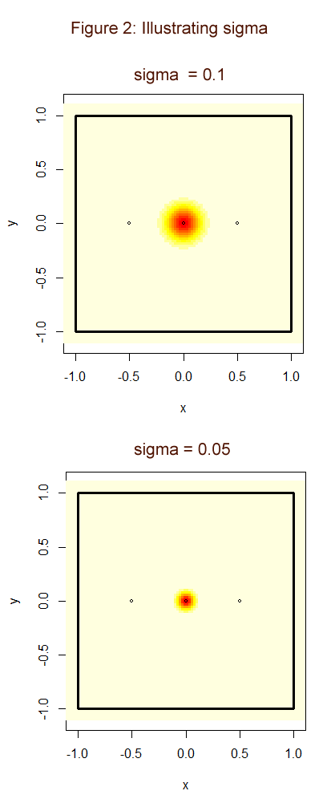

\clearpage

```{r, echo=FALSE, message=FALSE,warning=FALSE}
library(tidyverse)
library(knitr)
library(sf)
library(polyCub)
library(nngeo)
options(dplyr.summarise.inform=F)

source("Bears Script.R")
```


# Introduction

## The bear survey.

For several years now the population size and trends of brown bears in four regions of Sweden have and continues to be monitored. The total population and how it changes over time is important for conservation efforts and the setting of hunting quotas. If the hunting quotas are too large, the survival of the brown bear species could be in jeopardy. On the other hand if it is too low the population could grow large enough to cause problems in the ecosystem and for the local human population. The monitoring and estimation of the bear population is done through the collection of scat samples. The collection is done by volunteers. The genotypes are then identified through DNA analysis and used to get an estimate of the number of bears from which a scat sample has been obtained. We also expect that for a certain number of bears no samples will be found and as such the amount of such bears must be estimated statistically. The collection of spill samples takes place over a cycle of 5 years. Each year, spill samples are collected in one out of four regions in order. Every fifth year is an off year in which no collection takes place. Region 1 consists of the counties of Gävleborg and Dalarna, Region 2 is Västerbotten county, Region 3 consists of Västernorrland county and Jämtland and Region 4 is Norrbotten county. The samples are collected over 11 weeks in which the volunteers takes note of the location of the spill and collects a small piece to send for DNA analysis. 

The total bear population in Sweden is currently estimated using the Capture-Mark-Recapture method. The exact methods used is documented in @kindberg2011estimating. Traditionally the Capture-Mark-Recapture method involved physically capturing the animals in question. With advancements in DNA analysis it is now possible to perform the analysis by just "capturing" the DNA of the animals instead. This method is sometimes referred to as "Genetic mark-recapture methods". While similar the underlying models at work are quite different. When collecting scat samples for example there is no beforehand known upper limit to the number of "captures" as there is when using traps.

A problem with the division of Sweden into regions in the way the survey is performed is that brown bears do not care for these arbitrary borders. A bear could perform a temporary migration from the region it spends most of its time in to a neighbouring region and then possibly leaving a scat sample there. Should this happen, the bear could be counted twice for the census of the total population in Sweden which introduces bias to the estimation. Another problem with this is deciding which region a bear belongs to. One could assume that each bear has a territory that it wanders throughout regularly. Whichever region contains the largest share of this territory, or that contains the territories midpoint (activity center) could be considered the bears home region. Another method would be counting the bear as the ratio of its territory that lies within each region. Trying to estimate a bears territory only using the location of scat samples is difficult. For bears which only a single sample has been found, you can only get a rough idea of where that bears territory is located. For the bears from which no samples were discovered, there is no way to estimate a territory. Another complication with the border is how it affects the numbers of samples found for each bear. To estimate the number of bears for which no samples are found, the rate at which samples are observed needs to be estimated. In the method currently utilized, the rate is assumed to be constant for each bear. But due to the way the collection of samples is performed, only samples inside the current region can be found. As such a bear that has its territory close to the border is going to have their samples found at a lower rate than one far away from any border. This causes bias in the estimation of the rate of samples found, and therefore also in the estimation of the number of bears that go unobserved. The impact of these various sources of bias on the estimate of the bear populations do vary. It depends on the actual rate of samples found and the size of the bears territories relative to the regions. Should the rate of found samples be very high, the number of bears for which no samples are found will be close to zero. If bears have very small territories, then the probability that a bears territory will span more than one region is also very low. The capture-recapture methods that take the positions of animals into account is referred to as spatial capture-recapture. In this case it would specifically be spatial genetic capture-recapture or spatial genetic mark-recapture methods. A thorough explanation of the whys and hows of spatial methods can be found in @royle2018unifying.

To analyse how temporary migration affects the estimation of the bear population, we have performed a simulation study. By simulating a random number of bears over a region, varying the rate at which samples are found and the size of bears territories, the bias can be measured and illustrated. An alternative method for estimating the population, by summing the estimated ratio of a bears territory that lies within the region is also analysed to see if the bias can be mitigated. The simulation values will be chosen based on the values observed for the Swedish survey samples. The population estimates will be performed separately for the male and female bears, as we assume the size of their territories to be significantly different. An extra computationally intensive method will also be utilized on the Swedish survey samples as well to get an alternative estimate for the population. Finally we will also use the bias estimated from the simulation to create a theoretically unbiased estimate for the Swedish survey.

## Conclusions

Using the simulation study we observed that the bias in the population estimate scales close to linearly with the size of the bears territories relative to the regions size. The majority of the bias in the estimate was found to be caused by the observation of a large number of bears from outside the region currently being surveyed.

If applied to Swedish samples the relative bias was estimated to lie somewhere between 7% and 17% depending on region and the gender of the bear. However as the estimation of the size of the bears territories and the rate at which samples are discovered were found to be on average underestimated, the actual bias is assumed to be even larger, especially for regions with large territories and spill rates. The largest region, whose population was estimated to be 1033 bears was estimated to on average be overestimated by more than 127 bears using the standard estimation methods. However the largest difference between the simulation and the Swedish samples is the presence of the Baltic Sea on the eastern border of Sweden. As brown bears do not live in the sea, bears from outside the region are not observed along it while in the simulation, outsider bears are observed along all borders at the same average rate. However even accounting for this fact, the current methods used will on average overestimate the regions population. While changing the method for estimation does mitigate the bias somewhat, it still causes an on average overestimation of the population size. A better way to fix the bias in the estimation was deemed to instead be changing the method used for the collection of scat samples. By in addition gathering samples a distance outside of the currently surveyed region, bears from outside the region could more easily be identified and better estimates of the bears territory sizes and rate of samples observed could be obtained. This would in turn lead to better estimates of the regions populations.

## Acknowledgments

I would like to thank Martin Sköld for his advice and guidance.

\clearpage

# Method

We will be using R (@Rreference) as programming language to perform the simulations and analysis.
The R package sf (@sf) will be used to create polygonal areas for the spatial part of the analysis.
The R package polyCub (@R:polyCub) will be used to numerically calculate integrals of bivariate normally distributed distribution functions over polygonal areas.

## Statistical models and assumptions

For any area $S$ in the two dimensional Cartesian plane we are performing a survey on, we define the area that lies within distance $l$ from the border of $S$ as $O$ and $W$ as the union of $S$ and $O$. Both $S$ and $O$ have different bear populations and population densities that are not necessarily the same, however the population density is close to equal along the border between $S$ and $O$. 

In @miller2005new a Multinomial distribution is used as a model for the number of samples found for each individual. The idea is that we condition on the total number of samples observed, and for each sample assume that each bear has an equal probability of expelling the sample in question. As such the number of samples left by any bear is $Binomial(M, 1/N)$ where $M$ is the total number of samples and $N$ is the total population of bears in the region. Since we condition on the total number of samples found the binomial distribution for each bear is not independent of the other bears. The multinomial distribution is slightly difficult to work with, especially as due to spatial reasons the number of samples we expect to observe from each bear is not equal. Since the observed values for $M$ is relatively large and $1/N$ is relatively small, we could approximate the binomial distribution with the poisson distribution $Poisson(M/N)=Poisson(\lambda_0)$. However these Poisson distributions would not be independent of each other as the binomial distributions we are approximating from are not independent. However in @mcdonald1980poisson it is shown that approximating the multinomial distribution with independent Poisson distributions is a reasonable option. As such we choose to use independent Poisson distributions for the number of samples observed for each bear.

We first define the naive model that does not take the locations of the bears or their samples into account. We assume that the number of samples observed from bear number $i$ is $K_i \sim Poisson(\lambda_0)$. Any bear for which a sample has been observed belongs to the current region being surveyed.

Next we define the spatial model that does take the locations of the bears and samples into account. Each bear in $W$ has an activity center $\mu_i=(x, y) \in W$. Bear $i$ belongs to $S$ if and only if $\mu_i \in S$. We assume that the number of samples that bear number $i$ leaves is $K_i^{'} \sim Poisson(\lambda^{'})$. For each bear that has left a sample the _j_:th sample from the _i_:th bear has a location that is bivariate normally distributed $N(\mu_{i}, \sigma_0 I)$. Let $\phi$ be the standard bivariate normal distribution. Then $\phi(\frac {x-\mu_i}{\sigma_0})$ is the probability density function for the location of bear number $i$'s samples. We also use this function to describe the bears territory. The amount of time that a bear spends in any area $A$ is $\int_{A}^{} \phi(\frac {x-\mu_i}{\sigma_0}) \,{d \textbf x}$. For every sample left by a bear in $S$, it will be observed with probability $p$. if the sample is not in $S$, then the probability of it being observed is zero. Let $I_i = \int_{S}\phi(\frac {x-\mu_i}{\sigma_0})d \textbf x$, then the number of samples that bear number $i$ leaves inside $S$ is $K_{Si}^{'} \sim Poisson(I_i\lambda^{'})$ distributed. Since these samples are only observed with probability $p$, the distribution for the number of samples observed by bear number $i$ is binomially distributed $Binomial(K_{Si}^{'}, p)$, which is a conditional distribution. The binomial distribution where the number of repetitions is conditioned on the outcome of a poisson distributed variable is also poisson distributed. As such $Binomial(K_{Si}^{'}, p) \sim Poisson(pI_i\lambda^{'})$. As we are not specifically interested in neither $p$ nor $\lambda^{'}$, we can replace $p\lambda^{'}$ with $\lambda_0$ and focus only on the rate at which samples are observed. Therefore the number of observed samples left by bear number $i$ is $K_i \sim Poisson(I_i \lambda_0)$.


## Simulation

For this simulation $W$ is a $9 \times 9$ square with center in origo of the two dimensional Cartesian plane and $S$ is the 2 x 2 square centred around origo. We want $S$ and $O$ to have the same average population density. Since $S$ has an area of 4 square units and $W$ has an area of 36 that is 9 times larger, we simulate the population of $W$ from a $Poisson(9 \mu)$ distribution where $\mu$ is the mean population size of $S$.

To simulate $\mu_i$ we choose to use a homogeneous poisson process throughout the plane. As such for simulated bear number $i$ $\mu_i = (X_i, Y_i) \sim Uniform(W)$. Any bear with $\mu_i \in S$ is marked as a "True bear" and the rest as "False bear". The total number of "True bears" $N$ is what we are trying to estimate, so for each simulation we include a count of the number of observed "True bears". For each simulated bear we simulate the number of samples they leave from a $Poisson(\lambda)$ distribution. Each simulated sample then has its location simulated from the bivariate normal distribution $N(\mu_{i}, \sigma I)$. Any sample that is not contained in $S$ is then removed, then any bear with zero samples is also removed and the remaining samples are considered observed. 


$\lambda$ is estimated using the maximum likelihood estimate for a zero truncated poisson distribution, since we cannot observe the bears with zero samples observed.


Let $N^{\text{obs}}$ be the number of bears observed, $N^{\text{obs}}_T$ be the number of true bears observed and $N^{\text{obs}}_F$ be the number of false bears observed. We begin by defining the "standard estimate" that uses the naive model. Under this model $N^{\text{obs}}=N^{\text{obs}}_T$. Since we cannot observe the number of bears who left no samples, the number of samples left by the observed bears is zero-truncated Poisson distributed. Since the probability that an outcome of a $Poisson(\lambda)$ distribution is 1 or larger is $(1-e^{- \lambda})$, then according to our model we have 

$$E(N)(1-e^{- \lambda}) = E(N^{\text{obs}}).$$
To use this to estimate $N$ we first need to estimate $\lambda$. Since the number of samples from each observed bear is independent and identically distributed with zero-truncated Poisson distributions with parameter $\lambda$, we can use the maximum likelihood method to estimate it. We choose to perform this estimate numerically. Let $\hat \lambda$ be the MLE of $\lambda$, then the standard estimate for the total number of bears in $S$ is

$$\hat N =\frac {N^{\text{obs}}}{1-e^{-\hat \lambda}}.$$
To see the shortcomings in the naive model we now use the spatial model instead. First of all, $\hat \lambda$ is biased since the actual distribution for $K_i$ is $Poisson(I_i\lambda)$ distributed. As such the distributions are not identically distributed and the rate of observation of samples from several bears is strictly smaller than $\lambda$. As such we can expect $\hat \lambda$ to be on average underestimated. Furthermore the standard estimate is performed under the assumption that $N^{\text{obs}} = N^{\text{obs}}_T$, however in the spatial model $N^{\text{obs}} = N^{\text{obs}}_T + N^{\text{obs}}_F$, which means that

$$\hat N =\frac {N^{\text{obs}}_T + N^{\text{obs}}_F}{1-e^{-\hat \lambda}} .$$

Now the bias in the estimator; $\hat N - N$ can be divided into two terms like this,


$$\hat N - N =\frac {N^{\text{obs}}_F}{1-e^{-\hat \lambda}} + (\frac {N^{\text{obs}}_T}{1-e^{-\hat \lambda}}-N) .$$

The left term is the part of the bias introduced by the number of false bears that are observed. The right term is the bias we would observe if we could identify and remove all false bears. With the bias divided like this we can get an idea of how much of the bias is caused by the observation of false bears. The division is not as clean as we would want it to be as both terms are influenced by the estimate of $1/(1-e^{-\lambda})$ whose bias in part depends on the false bears observed. As such the right term is not independent of the bias caused by the false bears. However if the left term dominates the sum we can conclude that the majority of the bias is caused by the observation of the false bears. 

In addition to the standard estimation of $N$, we also want to try a different method. First we estimate the ratio of an observed bears estimated territory that lies within $S$ as

$$\hat I_i = \int_{S}{\phi(\frac{x -\hat \mu_i}{\hat \sigma}) d\textbf x},$$

where $\hat \mu_i$ is the mean of the observed sample's latitudinal and longitudinal coordinates. $\hat \sigma$ was estimated using the pooled sample variance method. Bears for which only one sample was observed have been removed. Since the standard deviation in longitudinal and latitudinal direction is $\sigma$ and independent of each other, we treat each sample as two measures of the deviation. Calculating $I_i$ requires integrating a bivariate normal distribution function over some irregularly shaped intersections between the territories and the $S$. These integrals need to be performed numerically. With this in hand, instead of using $N^{\text{obs}}$ in our estimation of $N$, we instead use 

$$N^{\text{obs}}_{RatioSum} =  \sum_{i=1}^{N^{\text{obs}}} \hat I_i ,$$

where bears are indexed in the order they were observed. In addition when estimating $\lambda$ instead of assuming each bear has the same rate of samples found, we instead assume each bear has their samples found at a rate of $Poisson(I_i \lambda)$. Let $p(n,\lambda^{'})$ be the probability of getting the value $n$ from a zero-truncated Poisson distribution with parameter $\lambda^{'}$. For our estimate of $\lambda$ we choose the value that maximizes the likelihood function   

$$f(\lambda)=\prod_{i=1}^{N^{\text{obs}}}   p(k_i,\hat I_i \lambda).$$

The maximization is performed numerically. We'll write this estimate of $\lambda$ as $\hat \lambda^{RatioSum}$. We'll then write the ratio sum estimate as 
$$\hat N^{RatioSum}=\frac{N^{\text{obs}}_{RatioSum}}{1 - e^{-\hat \lambda^{RatioSum}}}.$$

For the simulation we also need to choose values for $\mu$, $\lambda$ and $\sigma$. Preferably we want to choose these values close to the ones observed in the Swedish samples. A slight complication is that the parameter $\sigma$ also represents the radius of a circular territory in relation to the area of the region which contains its center. Therefore we need to normalize $\sigma$ in some way to make comparisons between regions of different sizes. The solution we choose is that for any region $A$, we divide $\sigma_A$ by the square-root of the area of $A$;

$$\sigma =  \frac {\sigma_{A}}{\sqrt{Area(A)}}.$$ 

However since all we want to do is compare the values observed in the Swedish regions with the ones from the simulation, we instead for any region $A$ choose to use "simulation normalized" $\sigma$; 

$$\sigma = \frac {2 \sigma_{A}}{\sqrt{Area(A)}}.$$ 

If $A$ is the area used in the simulation then we just get back $\sigma_A$ after the normalization since the simulation area has area 4. For any non-simulation area we normalize $\sigma$ and then by multiplying it by 2, convert it to the same scale as the one used for the simulation values. Henceforth whenever $\sigma$ is mentioned, it is the simulation normalized value. Figure 1 illustrates the size of the territories in relation to the simulation area for two values of $\sigma$. For $\lambda$ we choose values 2, 3 and 4 and for $\sigma$ we use 0.025, 0.05, 0.075, and 0.1. There is little reason to use $\lambda$ values higher than 4 because in our estimate of the total population size we use the transformation $1 / (1 - e^{-\lambda})$ instead of just $\lambda$ by itself.
When $\lambda$ is larger than 4 the transformations value changes very little as can be seen in Figure 2. We choose to keep $\mu$ at a constant value of 500 as the relative bias in the population estimate does not change with different average populations. A simulation was run to illustrate this and the results can be seen in figure 3.


## Application to the Swedish survey

For the real data we assume that all the assumptions of the simulation are true. Since male bears are known to wander further than female bears and as such would have very different values of $\sigma$, we choose to estimate their populations separately. To make comparisons between the real data and the simulated data we use the simulation normalized values for $\sigma$. Our estimates of $\mu_i$ are going to be biased since all observed samples are located inside $S$ so to account for that we will apply an optimizing function to each bear. We find the value of $\mu_i$ that maximizes the likelihood


$$l(\mu_i) = \sum_{j=1}^{K_i} log(\phi ((x_j - \mu_i) / \sigma) / \int_{S}^{} \phi ((x - \mu_i) / \sigma) \,dx)$$

where $x_j$ is the location of the bear in questions sample $j$. The function applies a penalty to $\mu_i$ further from the border which allows $\mu_i$ from outside $S$ to be possible outcomes. We replace our initial estimates of $\mu_i$ with the new estimates we get from maximizing the likelihood. As this optimization is performed numerically and includes a numerically calculated integral, running it thousands of times to test its results was deemed to take too much time, which is why we only use it on the Swedish samples and let its results be judged by the soundness of our arguments.

For the estimate of $N$, we use the standard estimate $\hat N$ along with three alternative methods for the estimate. The first is the Ratio Sum estimate $\hat N^{RatioSum}$. Second is the "Removing Outsiders" estimate defined as follows. We first define $N^{EstFalse}$ as the number of bears for which $\mu_i$ was adjusted to lie outside of the region and $\hat \lambda^{AltRatioSum}$ as the ratio sum estimate of $\lambda$ done after the adjustments of the bears activity centers is completed. Our estimate is then 
$$\hat N^{Removing Outsiders} = \frac{N^{\text{obs}}-N^{EstFalse}}{1 - e^{-\hat \lambda^{AltRatioSum}}}.$$
For the last estimate we want to try to use the mean bias for $\hat N$ we estimate using our simulation to adjust $\hat N$. Let $g(\sigma, \lambda)$ be the mean relative bias estimated using the simulation for $\hat N$ for the parameter values $\sigma$ and $\lambda$. We use this to create the "Simulation Unbiased" estimate 
$$\hat N^{SimUnbiased} =\frac{\hat N}{1 + g(\hat \sigma,\hat \lambda^{RatioSum})}.$$ 
As we do not have simulated results for the exact values of $\sigma$ and $\lambda$ for the values estimated from the Swedish samples, we choose to use rough estimates based on the values we do have for the values of $g$. The values we end up using to make these estimates are illustrated in Figure 4 in the results section. 


\clearpage

```{r, echo = FALSE, fig.cap = cap, fig.height = 8}
cap = "Illustrating the bears territory for two different values of $\\sigma$ in relation to the surveyed region (black box). The bear spends more time in the red area than in the yellow."

```

```{r, echo = FALSE, fig.cap = cap}
cap = "Function graph for $\\frac{1}{1 - e^{-\\lambda}}$"
FunctionGraph
```

```{r, echo = FALSE, fig.cap = cap}
cap = "Relative bias does not change with total population."
TotalPopulationRelativeBiasFigure
```

\clearpage

# Results

## Simulation results

```{r, echo = FALSE, warning=FALSE, message=FALSE, fig.cap = cap}
#Bias and standard error of the population estimate.
cap= "Mean relative bias of $\\hat N$."

PopulationEstimateFigure

```

```{r, echo = FALSE, fig.cap = cap}
#Figure 2: Mean number of false bears

cap = "Relative bias of $\\hat N$ divided into the bias caused by the number of observed false bears; 
$\\frac {N^{\\text{obs}}_F}{1-e^{-\\hat \\lambda}}$ 
and the bias if all the false bears were to be removed; 
$\\frac {N^{\\text{obs}}_T}{1-e^{-\\hat \\lambda}}-N$."

TrueFalseBiasFigure

```

```{r, echo =FALSE, fig.cap = cap}
#MLE bias and standard error

cap = "Mean bias in the standard estimations of the parameters $\\lambda$ and $\\sigma$."

ParameterBiasFigure

```

```{r, echo = FALSE, fig.cap = cap}
cap = "Comparing mean relative bias for $\\hat N$ and $\\hat N^{RatioSum}$."

RatioEstimateBiasFigure
```

```{r, echo = FALSE, fig.cap = cap}
cap = "Comparing mean bias of the maximum likelihood estimate of $\\lambda$ between the standard $\\hat \\lambda$ and $\\hat \\lambda^{RatioSum}$ estimate methods."
RatioLambdaEstimateBiasFigure
```

\clearpage

Figure 4 shows how the mean bias in $\hat N$ grows seemingly linearly as $\sigma$ grows. The mean bias grows faster as the value of $\lambda$ increases. Furthermore in Figure 5 we can observe how the majority of the bias in $\hat N$ can be attributed to the number of false bears observed. If all false bears could be identified and then eliminated from the sample, the remaining relative bias would not exceed 2.5%. Figure 6 then also shows that the standard methods utilized always underestimate both of the parameters and the bias grows along with $\sigma$ and $\lambda$. As both parameter estimates are biased, we cannot directly use the simulated data to get an exact estimation of the mean bias in a sample for which the underlying parameters are unknown unless $\sigma$ is relatively low.

Figure 7 shows that the ratio sum method for estimating $N$ is still biased but the rate at which it grows is smaller than the standard method for the same parameter values. For small values of $\sigma$ and $\lambda$, it is close to unbiased. In addition, Figure 8 shows that $\hat \lambda^{RatioSum}$ is a better estimator for $\lambda$ than $\hat \lambda$. Just as in Figure 7 the bias is less than the bias for the standard method for all parameter values.

\clearpage

## Swedish survey results

```{r, echo = FALSE, fig.cap = cap}
cap = "Estimation of the Swedish bear population in region 1, region 2 and region 3 using four different methods."
SwedishBearPopulationEstimateFigure1
```

```{r, echo = FALSE, fig.cap = cap}
cap = "Estimation of the Swedish bear population in Region 3 in the years 2015 and 2016 using four different methods."
SwedishBearPopulationEstimateFigure2
```

\clearpage


In figure 9 and 10 we see that $\hat N^{RemovingOutsiders}$ does not differ much from $\hat N$. $\hat N^{RatioSum}$ is noticeably lower than $\hat N$ and $\hat N^{SimUnbiased}$ is even lower. 

\clearpage

# Discussion


The bias in the population estimate grows as the parameters of the distribution functions used in the simulation, $\lambda$ and $\sigma$ grows. This bias can be attributed to the bears from outside for which samples have been observed and to the bias in the estimation of $\lambda$. However the bias introduced by bears from outside vastly exceeds the bias from the estimation of $\lambda$. The mean bias in $\hat N$ can be seen as a function of the underlying parameters $\lambda$ and $\sigma$. As such, if we could calculate an expression for this bias function and knew the values of these parameters for a collection of samples, then we could get an estimate of the bias in that collection. However for a real collection of samples these parameters must also be estimated first. This is a problem, since the estimates for them are biased and the bias is larger the higher the values for the parameters are. However in addition for this to be a good method, the assumptions made for the simulation must hold true.

For each of the 4 regions in Sweden and for each sex separately $\sigma$ is estimated to lie somewhere in-between 0.043 and 0.092. The simulation estimates would suggest that the relative bias lies in-between 7 and 17 percent. However the Swedish regions do differ from the simulation in certain ways. For example: part of each Swedish region borders the Baltic Sea in which brown bears are not known to live. As such the assumption that the population density of the outside region is the same as in the inside region along the border does not hold for any of the Swedish regions. A better approximation of the bias could be achieved by multiplying the bias by the ratio of the border that does not touch the Baltic Sea.

While the simulation most likely differs from the Swedish survey in more ways, if the spatial part of the collection of samples is ignored, then bears from outside the region will be counted twice for the total survey. $\lambda$ will also be underestimated, which will cause an on average over-estimation of the regions bear population. By how much is difficult to say. While the ratio sum method could theoretically give better estimations changing the current surveying methods to better take the problem caused by the borders into account would be more likely to get better results. A way to get a better understanding of the border problem would be to extend the search for samples to some distance outside of the region currently being investigated. That way you could remove bears observed close to the new border for better estimates of $\lambda$ without losing too much information. We would simultaneously be able to better identify bears from outside the region, which would mitigate the bias caused by them.


\clearpage


# Appendix

```{r, echo=FALSE, fig.cap = cap}
cap = "Bias in the transformation $\\frac{1}{1 - e^{-\\lambda}}$ of $\\lambda$ which is used in $\\hat N$."
#Bias and standard error for the multiplication factor.

MultiplicationFactorFigure

```

\clearpage

```{r, echo=FALSE, fig.cap = cap}
cap = "A"

options(knitr.kable.NA = '')

SwedishResultsTable %>%
  mutate(sex = case_when(sex == "Hane" ~ "Male",
                         sex == "Hona" ~ "Female",
                         sex == "Total" ~ "Total")) %>%
  rename("Outsiders Removed Estimate" = "Alt Estimate",
         "Ratio Sum Estimate" = "Ratio Estimate",
         "Standard Lambda Estimate" = "Standard Lambda",
         "Alternative Lambda Estimate" = "Alt Lambda",
         "Simulation Normalized Sigma" = "Normalized Sigma") %>%
  kable(caption = "Population and parameter estimates for Sweden.")

```

```{r, echo=FALSE, fig.cap = cap}
cap = "A"
EstimatedBiasTable %>%
  relocate(year, sex) %>%
  arrange(year, sex) %>%
  select( year, sex, "Standard Estimate", "Simulated Unbiased Estimate", "Simulated Bias Estimate", "Estimated Simulated Bias") %>%
  rename("Simulated Relative Bias Estimate" = "Simulated Bias Estimate") %>%
  kable(caption = "Simulated bias estimate for Sweden")
```


Link to github repository containing the code and materials used in this project.

(https://github.com/Martin4188/Bears-Across-Borders)

\clearpage

# References


