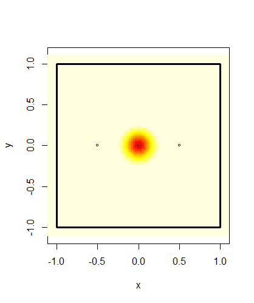
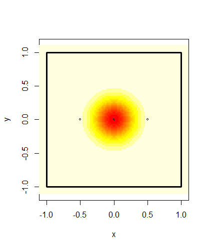
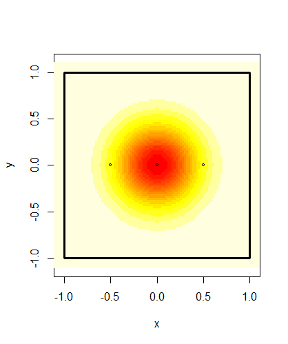

```{r, echo=FALSE, message=FALSE,warning=FALSE}
library(tidyverse)
library(knitr)
options(dplyr.summarise.inform=F)

NaiveSimulation <- read_csv("data/NaiveSimulation")
NaiveSimulationSmallSigma <- read_csv("data/NaiveSimulationSmallSigma")

source("Bears Script.R")
```

```{r, echo=FALSE}
print("Sigma = 0.025")
include_graphics("ImageData/Sigma0point025.png")

print("Sigma = 0.1")


print("Sigma = 0.2")


print("Sigma = 0.3")


Figure1
Figure2
Figure3
Figure4
Figure5
```


***Introduction***

***EXPLAINING THE BEAR INVENTORY***

For several years now the population size and trends of brown bears in four regions of Sweden have and continues to be monitored.
The total population and how it changes over time is important for conservation efforts and the setting of hunting quotas. If the hunting quotas are too large the survival of the brown bear species could be in jeopardy. On the opposite if it is too low the population could grow large enough to cause problems in the eco system or for the local human population.

***HOW IT WAS COLLECTED***

The monitoring and estimation of the bear population is done through the collection of scat samples. The collection is done by volunteers and genotypes are identified through dna analysis and used to get an estimate of the number of bears from which a scat sample has been obtained. We also expect that for a certain number of bears no samples will be found and as such the population of such bears must be estimated statistically.

The collection of spill samples takes place over 5 years in which spill samples are collected in one region each year in order with the fifth year is an off year when no collection takes place. The samples are collected over 11 weeks in which the volunteers notes down the location of the spill and collects a small piece to send in for DNA analysis.

Region 1 consists of both Gävleborg and Dalarna,Region 2 is Västerbottenslän, Region 3 consists of both Västernorrlandslän and Jämtland ,  and Region 4 is Norrbottenslän

The estimation of the total bear population is currently modeled using the Capture-Mark-Recapture method. A full explanation of the methods used can be found in Kindberg2011.

***PROBLEMS***

A problem with the division of Sweden into Regions in this way is that brown bears do not care for these arbitrary borders.
A bear could be found on one side of the border one year and the other in another year. Should this happen the bear would be counted twice for the census of the total population in Sweden which introduces bias to the estimation. 

Another problem with this is deciding which region a bear belongs to. One could assume that each bear has a territory throughout which it wanders regularly. Whichever region contains the largest share of this territory or that contains the territories midpoint could be considered the bears home region. Another method would be counting the bear as the ratio of its territory that lies within each region. 

Male brown bears, especially young ones are known to wander freely and it is not unthinkable that their territory changes dramatically between years. 

Trying to estimate a bears territory only using the location of scat samples is difficult. For bears which only a single sample has been found you can only get a rough idea of where that bears territory is located. For the bears that no samples were discovered there is no way to assign them a territory.

Another complication with the border problem is how it affects the numbers of samples found for each bear. To estimate the number of bears for which zero samples are found the rate at which samples are found needs to be estimated. The rate is assumed to be constant for each bear but due to the way the collection of samples is performed only samples inside the region currently being sampled can be found. As such a bear that has its territory close to the border is going to have their samples found at a lower rate causing bias in the estimation of the rate and therefore also in the estimation of the number of bears with zero samples found.

The impact of these various sources of bias on the estimate of the bear populations do vary depending on what the actual rate of samples found and the size of the bears territories are. Should the rate of found samples be very high the number of bears for which zero samples are found will be close to zero. If bears have very small territories then the probability that a bears territory will span several regions is also very low.  

***HOW TO INVESTIGATE PROBLEMS***

To analyse how the border problem affects the estimation of the bear population we have performed a simulation study.
By simulating a random number of bears over a created region and varying the rate at which samples are found and the size of bears territories the bias can be measured and illustrated.

***CONCLUSIONS***

Using the simulation study we concluded that the bias in the population estimate scales close to linearly with the size of the bears territories. For very small territories the population estimate exceeds the true population by somewhere between 5 and 10 percent with only minor differences in bias for different simulated rates of discovered samples. Should however the territory be much larger the population estimate could exceed the true population by over 60%.

The main source of this bias comes from the bears from outside the inventoried region. The amount of bears from outside that are observed grow as territory sizes grow and the among all observed bears between 5 to 40% of them could be from outside. The amount of outside bears also increases noticeably as the rate of found samples increase.

Estimating the rate at which samples are left by bears was found to be biased as well. As the rate of samples found and as the bears territories increase, the bias in the estimate increase as well. Since we can't get an accurate estimate of this rate it is difficult to estimate the population estimate bias from a real world sample in which the rate is unknown.


***Method***

We will be using the R language with RStudio to perform all calculations.
The package tidyverse will be used for data management.

***STATISTICAL MODELS AND ASSUMPTIONS***

For any area we are performing an inventory on $S$, we define the area that lies within distance $l$ from the border of $S$ as $O$ and $W$ as the union of $S$ and $O$. Both $S$ and $O$ have different bear populations but with the same population density. 

The number of samples that each bear $b_i$ leaves is $K_i \sim Poisson(\lambda_0)$. Each sample $k_{ij}$ has a location that is bivariate normally distributed $N(\textbf \mu_{i}, \sigma I)$ where . We assume the distribution function for this bivariate normal distribution $T_i$ to be the shape of the bears territory. The bear spends more time closer to the midpoint than further away from it.

If $k_{ij} \in S$ then it will be observed with probability $p$ and if $k_{ij} \not\in S$ then the probability of it being observed is zero. Let $I_i = \int_{S}T_id \textbf x$ then the number of samples that $b_i$ leaves inside $S$ is $K_{Si} \sim Poisson(I_i\lambda_0)$ distributed. Since these samples are only observed with probability $p$ the distribution for the number of samples observed by $b_i$ is binomially distributed $B(K_{Si}, p)$ which is a conditional distribution. The binomial distribution where the number of repetitions is conditioned on the outcome of a poisson distributed variable is also poisson distributed so $B(K_{Si}, p) \sim Poisson(pI_i\lambda_0)$. As we are not specifically interested in neither $p$ nor $lambda_0$ we can replace $p\lambda_0$ with $\lambda$ and focus only on the rate at which samples are observed. Therefore the number of observed samples left by $b_i$ is $O_i \sim Poisson(I_i \lambda)$.

***HOW IT IS SIMULATED***

For this simulation $W$ is a 9 x 9 square with center in origo of the two dimensional Cartesian plane and $S$ is the 2 x 2 square centred around origo. We want $S$ and $O$ to have the same average population density and since $S$ has an area of 4 square units and $W$ has an area of 36 that is 9 times larger we simulate the population of $W$ from a $poisson(9 \mu)$ distribution where $\mu$ is the mean population size of $S$. The reason the poisson distribution was chosen for the population size is because for large mean the distribution is close to a normal distribution but discrete.

To keep it simple the bears are uniformly distributed throughout $W$. As such each simulated bear $b_i$ has a territory midpoint  $\mu_i = (X_i, Y_i) \sim (U_{-3,3}, U_{-3,3})$. Any bear whose midpoint lies within $S$ is marked as a "True Bear" and the rest as "False bears". The total number of "True bears" $N$ is what we are trying to estimate so for each simulation we include this total. 
For each $b_i$ we simulate the number of samples they leave from a $Poisson(\lambda)$ distribution. Each simulated sample then has its location simulated from the bivariate normal distribution $N(mu_{i}, \sigma I)$. Any sample that is not contained in $S$ is then removed and then any bear with zero remaining samples is also removed and the remaining samples are considered observed. The number of True bears and False Bears for which at least one sample has been observed is then counted.

$\lambda$ is estimated using the maximum likelihood estimate for a zero truncated poisson distribution since we cannot observe the bears with zero samples observed.

Let $NObs$ be the number of bears observed, $NObsTrue$ be the number of bears observed whose midpoint actually belong to $S$ and $NObsFalse$ be the number of bears observed whose midpoint does not belong to $S$.

The estimate for the total number of bears in $S$ is then.

$$\hat N =\frac {NObs}{1-e^{\hat \lambda}}$$
However this is done under the assumption that $NObs = NObsTrue$. However in actuality

$$NObs = NObsTrue + NObsFalse$$

Which means that

$$\hat N =\frac {NObsTrue + NObsFalse}{1-e^{\hat \lambda}}$$

Since we measure the true value of $N$ we can measure the bias $\hat N - N$ and analyse it.

For the simulation values of $\lambda$ and $\sigma$, values close to the ones observed for the bear census were used.

For $\lambda$ we use values 2, 3 and 4 and for $\sigma$ we use 0.025, 0.05, 0.075, 0.1, 0.2 and 0.3.


***Results***

In Figure 1 we can see how the bias in the population estimate bias grows seemingly linearly as $\sigma$ grows while changes in $\lambda$ adjusts the slope coefficient. As $\sigma$ approaches zero each bears territory converges towards a single point, that being the midpoint of the territory. When the bears territories are that small the probability that a any bears territory will intersect with a region that the bear does not belong to is negligible and all bears will only leave spills inside their own region. However for large $\sigma$ the relative bias is quite high with the estimate possibly being more than 60% larger than the true population. 


```{r, echo = FALSE, warning=FALSE, message=FALSE}
#Bias and standard error of the population estimate.

Figure1

```

```{r, echo = FALSE}
#Figure 2: Mean number of false bears

Figure2

```


***Discussion***

# What conclusions can we draw from results?
# Future directions for research.

The model used to reach these conclusions are based on several simplifying assumptions. The assumption that bears have clearly defined territories is doubtful specifically for the male bears. 

A possible way to identify bears from outside the region that is being censused would be to extend the search for samples some distance outside the region.

As the collection is done by volunteers we only have samples collected from where they went. As such the border of the region being inventoried is not neccesarily the regions borders but the border of the area that at least one volunteer has passed through.


***Appendix***

```{r, echo =FALSE}
#MLE bias and standard error

Figure3

```

```{r, echo=FALSE}
#Estimated ratio of bear population observed

Figure4

```

#Include link to github repository.

https://github.com/Martin4188/Bears-Across-Borders

***References***

-bibtex file


```{r, echo=FALSE}
citation()
citation("tidyverse")
citation("knitr")
citation("polyCub")
```


