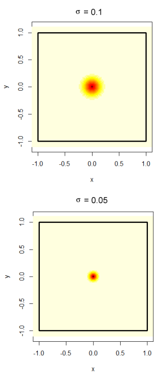

\clearpage

```{r, echo=FALSE, message=FALSE,warning=FALSE}
library(tidyverse)
library(knitr)
library(sf)
library(polyCub)
library(nngeo)
options(dplyr.summarise.inform=F)

source("Bears Script.R")
```


```{r, echo=FALSE}
#print("Sigma = 0.025")
#include_graphics("ImageData/Sigma0point025.png")


#Figure1
#Figure2
#Figure3
#Figure4
#Figure5
#Figure7
#SwedishResultsTable %>%
#  kable()
#EstimatedBiasTable %>%
#  relocate(year, sex) %>%
#  arrange(year, sex) %>%
#  kable()
```


# Introduction

## The bear inventory.

For several years now the population size and trends of brown bears in four regions of Sweden have and continues to be monitored.
The total population and how it changes over time is important for conservation efforts and the setting of hunting quotas. If the hunting quotas are too large the survival of the brown bear species could be in jeopardy. On the opposite if it is too low the population could grow large enough to cause problems in the eco-system or for the local human population.

The monitoring and estimation of the bear population is done through the collection of scat samples. The collection is done by volunteers and genotypes are identified through DNA analysis and used to get an estimate of the number of bears from which a scat sample has been obtained. We also expect that for a certain number of bears no samples will be found and as such the population of such bears must be estimated statistically.

The collection of spill samples takes place over 5 years in which spill samples are collected in one region each year in order with the fifth year is an off year when no collection takes place. The samples are collected over 11 weeks in which the volunteers notes down the location of the spill and collects a small piece to send in for DNA analysis.

Region 1 consists of both Gävleborg and Dalarna ,Region 2 is Västerbottenslän, Region 3 consists of both Västernorrlandslän and Jämtland, and Region 4 is Norrbottenslän.

The estimation of the total bear population is currently modeled using the Capture-Mark-Recapture method. Traditionally the Capture-Mark-Recapture method involved physically capturing the animals in question but with advancements in DNA analysis it is now possible to perform the analysis by just "capturing" the DNA of the animals instead. This method is sometimes referred to as "Genetic mark-recapture methods". While similar the underlying models at work are quite different. When collecting scat samples for example there is no beforehand known upper limit to the number of "captures" like there might be when using traps. A thorough explanation of this "genetic mark-recapture" method we use can be found in the article _"A new method for estimating the size of small populations from genetic mark--recapture data"_ by @miller2005new. A full explanation of the methods used in the Swedish survey be found in _"Estimating population size and trends of the Swedish brown bear Ursus arctos population"_ @kindberg2011estimating.

A problem with the division of Sweden into regions in this way is that brown bears do not care for these arbitrary borders.
A bear could be found on one side of the border one year and the other in another year. Should this happen the bear would be counted twice for the census of the total population in Sweden which introduces bias to the estimation. 

Another problem with this is deciding which region a bear belongs to. One could assume that each bear has a territory throughout which it wanders regularly. Whichever region contains the largest share of this territory or that contains the territories midpoint could be considered the bears home region. Another method would be counting the bear as the ratio of its territory that lies within each region. 

Trying to estimate a bears territory only using the location of scat samples is difficult. For bears which only a single sample has been found you can only get a rough idea of where that bears territory is located. For the bears that no samples were discovered there is no way to assign them a territory.

Another complication with the border problem is how it affects the numbers of samples found for each bear. To estimate the number of bears for which zero samples are found the rate at which samples are found needs to be estimated. The rate is assumed to be constant for each bear but due to the way the collection of samples is performed only samples inside the region currently being sampled can be found. As such a bear that has its territory close to the border is going to have their samples found at a lower rate causing bias in the estimation of the rate and therefore also in the estimation of the number of bears with zero samples found.

The impact of these various sources of bias on the estimate of the bear populations do vary depending on what the actual rate of samples found and the size of the bears territories are. Should the rate of found samples be very high the number of bears for which zero samples are found will be close to zero. If bears have very small territories then the probability that a bears territory will span several regions is also very low.  

The method capture-recapture methods that take the positions of animals into account is referred to as spacial capture-recapture and in this case it would specifically be spatial genetic mark-recapture methods. A thorough explanation of why and how spatial methods are useful can be found in _"Unifying population and landscape ecology with spatial capture–recapture"_ @royle2018unifying.

To analyse how the border problem affects the estimation of the bear population we have performed a simulation study.
By simulating a random number of bears over a created region and varying the rate at which samples are found and the size of bears territories the bias can be measured and illustrated. An alternative method for estimating the population by summing the estimated ratio of a bears territory that lies within the region is also analyzed to see if the bias can be mitigated.

The simulation values will be chosen based on the values observed for the Swedish survey samples. The population estimates will be performed separately for the male and female bears as we assume the size of their territories to be significantly different. An extra calculation heavy method will also be utilized on the Swedish survey samples as well to get an alternative estimate for the population.

## Conclusions

Using the simulation study we observed that the bias in the population estimate scales close to linearly with the size of the bears territories relative to the regions size. The majority of the bias in the estimate was found to be caused by the observation of a large number of bears from outside the region currently being inventoried.

If applied to Swedish samples the relative bias was estimated to lie somewhere between 7% and 17% depending on region and the gender of the bear. However as the estimation of the size of the bears populations and the rate at which samples are discovered were found to be underestimated the actual bias would be assumed to be even larger. The largest region was estimated to on average be overestimated by more than 127 bears using the standard estimation methods.

However as many of the assumptions of the simulation study do not hold for the Swedish regions, the bias is in most likelihood not as severe as the simulation makes it seem. It does however seem likely that the currently employed methods will on average overestimate the population size.

While changing the method for estimation does mitigate the bias somewhat it still causes an on average overestimation of the population size. A better way to fix the bias in the estimation was deemed to instead be changing the method used for the collection of scat samples to include gathering samples a distance outside of the currently inventoried region. That way bears from outside the region could more easily be identified and better estimates of the bears territory sizes and rate of samples observed could be obtained.

## Acknowledgments

I would like to thank Martin Sköld for his advice and guidance.

\clearpage

# Method

We will be using R (@Rreference) as programming language to perform the simulations and analysis.
The R package sf (@sf) will be used to create polygonal areas for the spatial part of the analysis.
The R package polyCub (@R:polyCub) will be used to numerically calculate integrals of bivariate normally distributed distribution functions over polygonal areas.

## Statistical models and assumptions

For any area we are performing an inventory on $S$, we define the area that lies within distance $l$ from the border of $S$ as $O$ and $W$ as the union of $S$ and $O$. Both $S$ and $O$ have different bear populations but with the same population density. 

In @miller2005new a Multinomial distribution is used as a model for the samples. The idea is that we condition on the number of samples observed and for each sample assume that each bear has an equal probability of expelling the sample in question. As such the number of samples left by any bear is $B(M, 1/N)$ where $M$ is the total number of samples and $N$ is the total population of bears in the region. However the multinomial distribution is slightly difficult to work with especially as due to spatial reasons the number of samples we expect to observe from each bear is not equal for all bears. As it is easier to work with each bear having its own independent distribution for the number of samples it leaves we will instead assume each bear leaves samples based on the $B(M, 1/N)$ distribution. Since the observed values for $M$ is relatively large and $1/N$ is relatively small we can approximate the binomial distribution with the poisson distribution $Poisson(M/N)=Poisson(\lambda_0)$. 

A thorough explanation of approximating the multinomial distribution with the poisson distribution can be read in _"On the Poisson approximation to the multinomial distribution"_ @mcdonald1980poisson.

The number of samples that bear number $i$ leaves is $K_i \sim Poisson(\lambda_0)$. For each bear that has had a sample observed the sample $k_{ij}, j = 1,...,.n$ has a location that is bivariate normally distributed $N(\mu_{i}, \sigma I)$ and we let $T_i(\textbf x)$ be the probability distribution function for this distribution. We also use $T_i$ to describe bear $i$'s territory. The amount of time that a bear spends in any area $A$ some time before and up until the inventory period is $\int_{A}^{} T_i(\textbf x) \,{d \textbf x}$.  

If $k_{ij} \in S$ then it will be observed with probability $p$ and if $k_{ij} \not\in S$ then the probability of it being observed is zero. Let $I_i = \int_{S}T_id \textbf x$ then the number of samples that bear number $i$ leaves inside $S$ is $K_{Si} \sim Poisson(I_i\lambda_0)$ distributed. Since these samples are only observed with probability $p$ the distribution for the number of samples observed by bear number $i$ is binomially distributed $B(K_{Si}, p)$ which is a conditional distribution. The binomial distribution where the number of repetitions is conditioned on the outcome of a poisson distributed variable is also poisson distributed so $B(K_{Si}, p) \sim Poisson(pI_i\lambda_0)$. As we are not specifically interested in neither $p$ nor $\lambda_0$ we can replace $p\lambda_0$ with $\lambda$ and focus only on the rate at which samples are observed. Therefore the number of observed samples left by bear number $i$ is $O_i \sim Poisson(I_i \lambda)$.

## Simulation

For this simulation $W$ is a 9 x 9 square with centre in origo of the two dimensional Cartesian plane and $S$ is the 2 x 2 square centred around origo. We want $S$ and $O$ to have the same average population density and since $S$ has an area of 4 square units and $W$ has an area of 36 that is 9 times larger we simulate the population of $W$ from a $poisson(9 \mu)$ distribution where $\mu$ is the mean population size of $S$.

For the location of bears midpoints in $W$ we choose to use a homogeneous poisson process throughout the plane. As such each simulated bear number $i$ has a territory midpoint  $\mu_i = (X_i, Y_i) \sim (U_{-3,3}, U_{-3,3})$. Any bear whose midpoint lies within $S$ is marked as a "True Bear" and the rest as "False bears". The total number of "True bears" $N$ is what we are trying to estimate so for each simulation we include this total. 
For each simulated bear we simulate the number of samples they leave from a $Poisson(\lambda)$ distribution. Each simulated sample then has its location simulated from the bivariate normal distribution $N(\mu_{i}, \sigma I)$. Any sample that is not contained in $S$ is then removed and then any bear with zero remaining samples is also removed and the remaining samples are considered observed. The number of True bears and False Bears for which at least one sample has been observed is then counted.

To see how well we can estimate $\sigma$ with the current sampling method we will also make an estimation of $\sigma$ in the simulation. We estimate $\sigma$ by removing all bears that only have one sample discovered and then using the pooled sample variance method.

$\lambda$ is estimated using the maximum likelihood estimate for a zero truncated poisson distribution since we cannot observe the bears with zero samples observed.

Let $N^{\text{obs}}$ be the number of bears observed, $N^{\text{obs}}_T$ be the number of bears observed whose midpoint actually belong to $S$ and $N^{\text{obs}}_F$ be the number of bears observed whose midpoint does not belong to $S$.

Since the probability that an outcome of a $Poisson(\lambda)$ distribution is 1 or larger is $(1-e^{- \lambda})$ then we have 

$$N(1-e^{- \lambda}) = E(N^{\text{obs}})$$

The estimate for the total number of bears in $S$ is then.

$$\hat N =\frac {N^{\text{obs}}}{1-e^{\hat \lambda}}$$
However this is done under the assumption that $N^{\text{obs}} = N^{\text{obs}}_T$. However in our case

$$N^{\text{obs}} = N^{\text{obs}}_T + N^{\text{obs}}_F$$

Which means that

$$\hat N^{\text{obs}} =\frac {N^{\text{obs}}_T + N^{\text{obs}}_F}{1-e^{\hat \lambda}}$$

Which we could rewrite as

$$\hat N^{\text{obs}} =\frac {N^{\text{obs}}_T + N^{\text{obs}}_F}{{N^{\text{obs}}_T}}\frac {N^{\text{obs}}_T}{1-e^{\hat \lambda}}$$

Which gives us two factors of which the left depends on the problem related to the number of false bears observed and the right depends on the error in the estimation of $\lambda$.

Since we measure the true value of $N$ we can measure the bias $\hat N - N$ and analyse it.

As an alternative method to estimate the population we instead of using $N^{\text{obs}}$ in our estimation of $N$ we instead use 

$$N^{\text{obs}}_{RatioSum} =  \sum_{i}^{} I_i $$
This being the sum of the estimated ratio of an observed bears territory that lies within the inventoried region. In addition when estimating $\lambda$ instead of assuming each bear has the same rate of samples found we instead assume each bear has their samples found at a rate of $Poisson(I_i \lambda)$ and use the density function for this distribution when calculating the maximum likelihood estimate for $\lambda$. 


When simulating we use $\lambda$ values 2, 3 and 4 and for $\sigma$ we use 0.025, 0.05, 0.075, and 0.1. These values were chosen because they are close to the ones estimated for the Swedish sample. There is little reason to use $\lambda$ values higher than 4 because in our estimate of the total population size we use the transformation $1 / (1 - e^{-\lambda})$ instead of just $\lambda$ by itself.
When $\lambda$ is larger than 4 the transformations value changes very little as can be seen in Function Graph 1.

```{r, echo = FALSE}
FunctionGraph
```


We choose to keep $\mu$ at a constant value of 500 as the relative bias in the population estimate does not change with different average populations. A simulation was run to illustrate this and the results can be seen in FIGURE 1.

```{r, echo = FALSE}
TotalPopulationRelativeBiasFigure
```
Figure 2 illustrates the size of the bears territories for two different values of $\sigma$. The bear spends more time in the red area of the territory than in the yellow part. 

```{r, echo = FALSE}

```


## Application to the Swedish survey

The idea with the alternative model is to take the positions of the bears into account when making the estimations of the underlying parameters. Since the bears territories are binormally distributed, estimating how much of the territories lies within a certain region requires integrating over some irregularly shaped intersections between the territories and the region in question the integrals needs to be performed numerically. These numerical methods will then also be used in combination with an optimizing function to adjust the midpoints of bears since these estimated midpoints are going to be biased to lie inside the inventoried region as we only discover samples there within. The optimizing function causes these calculations to take a very large time when they need to be repeated thousands of times in a simulation to get an estimate for their effectiveness. As such these methods will only be used on the real samples and their effect will need to be trusted based on their soundness. 

For the real data we assume that all the assumptions of the simulation are true. Since male bears are known to wander further than female bears and as such would have very different values of $\sigma$ we choose to estimate their populations separately. $\sigma$ is estimated again using the pooled variance method. To make comparisons between the real data and the simulated data we also want to get a normalized value for them both. For this we choose to use $\frac {\sigma}{\sqrt{Region Area}}$. Since the area in the simulation is 4 we can use the value of $\frac {2\sigma}{\sqrt{Region Area}}$ to make comparisons between the real data and the simulation.

The midpoint coordinates of each bear is estimated as the mean of the samples lateral and longitudal coordinates. The midpoints are going to be biased since all samples are located inside the region so to account for that we will apply an optimizing function to each bear. We find the midpoint $\mu$ that optimize the function 


$$l(\mu) = \sum_{1}^{n} log(\phi ((x_i - \mu) / \sigma)) / \int_{S}^{} \phi ((x - \mu) / \sigma) \,dx$$

where $x_i$ is the location of the bear in questions sample $i$ and $\phi$ is the standard bivariate normal distribution. The function applies a penalty to midpoints further from the border which allows midpoints from outside the region in question to be possible outcomes.

After each bears midpoint has been adjusted we can calculate $I_i$ (The integral of the bears territory over the Region) and then get the maximum likelihood estimate for $\lambda$ where each bears number of samples found is assumed to be a outcome of $Poisson(I_i\lambda_0)$. 

For the estimate of the bear population we use the standard method along with three alternative methods for the estimate. The first is to simply remove any bear whose midpoint was adjusted to lie outside the region and then use $\hat \lambda$ to estimate the number of bears for which zero samples were discovered. The second is to again using $N^{\text{obs}}_{RatioSum}$ instead of $N^{\text{obs}}$. The third is to subtract the estimated bias from the simulation of the standard method to make a theoretically unbiased estimate of the population.

\clearpage

# Results

## Simulation results

```{r, echo = FALSE, warning=FALSE, message=FALSE}
#Bias and standard error of the population estimate.

PopulationEstimateFigure

```

Figure 3 shows how the mean bias in the population estimate grows seemingly linearly as $\sigma$ (The size of the bears territories) grows. The mean bias grows faster as the value of $\lambda$ (The rate at which samples are discovered) increases. 

```{r, echo = FALSE}
#Figure 2: Mean number of false bears

TrueFalseBiasFigure

```

Figure 4 shows the bias divided into 2 categories. The lambda bias $\frac {N^{\text{obs}}_T}{1-e^{\hat \lambda}} - N$ which is the mean bias in the population estimate we would have if only true bears were observed. The false bear bias is $\frac {N^{\text{obs}}_F}{1-e^{\hat \lambda}}$ which is the number of false bears observed in the sample further amplified by the factor we use to estimate the bears for which no samples were discovered.

We can observe how the majority of the bias in population estimate can be attributed to the number of false bears observed and how it grows much faster than the error caused by the bias in the estimate of $\lambda$.
If all false bears could be eliminated from the sample the remaining relative bias would not exceed 2.5%. 

```{r, echo =FALSE}
#MLE bias and standard error

ParameterBiasFigure

```

Figure 5 shows the bias when estimating the underlying parameters of the simulation. The methods utilized always underestimate both of the parameters and the bias grows along with $\sigma$. As both parameters are biased we cannot directly use the simulated data to get an exact estimation of the mean bias in a sample for which the underlying parameters are unknown.

```{r, echo = FALSE}
RatioEstimateBiasFigure
```

Figure 6 shows that the ratio sum method for estimating the population is still biased but the rate at which it grows is smaller than the standard method for the same parameter values. For small values of $\sigma$ and $\lambda$ it is very close to being unbiased.

```{r, echo = FALSE}
RatioLambdaEstimateBiasFigure
```

Figure 7 shows that the ratio sum method is also better for estimating the value of $\lambda$ than the standard method. Just as in Figure 6 the bias is less than the bias for the standard method for all parameter values.

## Swedish survey results

```{r, echo = FALSE}
SwedishBearPopulationEstimateFigure1
```

```{r, echo = FALSE}
SwedishBearPopulationEstimateFigure2
```


In figure 6 and 7 we can see the estimates of the bear population for 5 years of the Swedish survey. Year 2015 and 2020 were both performed on the same region. The standard estimate is the one that is made without taking the location of the samples into accounts. 

The removing outsiders estimate is the one in which the bears midpoints were re-evaluated and the bears whose midpoints ended up outside the region were removed. The method also improves the estimation of $\lambda$ by taking into account that bears closer to the borders will have fewer mean number of samples observed. 

The Ratio estimate instead of counting each bear observed as one bear instead counts the estimated ratio of the bears territory that lies inside the surveyed region along with the alternative estimation of $\lambda$. 

The Simulated Unbiased Estimate assumes that the estimated values of $\sigma$ and $\lambda$ are true and reduce the standard estimate by the simulated mean bias for the corresponding parameter values. As the parameters are on average underestimated and the mean bias grows as the parameters grow we expect this estimate to overestimate the bear population if all the assumptions of the simulation are true.  

The removing outsiders estimate does not differ much from the standard estimate. The ratio sum estimate is noticeably lower than the standard estimate. The simulated unbiased estimate is quite a bit lower than the Ratio Estimate and is much lower than the standard estimate.

\clearpage

# Discussion


The bias in the population estimate grows as the parameters of the distribution functions used in the simulation $\lambda$ (The rate at which samples are found) and $\sigma$ (The size of the bears territories) grows.

This bias can be attributed to the false bears for which samples have been observed and to the bias in the estimation of $\lambda$, However the bias introduced by the false bears vastly exceeds the bias from the estimation of $\lambda$. 

The mean bias in the population estimate can be seen as a function of the underlying parameters $\lambda$ and $\sigma$ that defines the size of a bears territory. As such if we could calculate an expression for this bias function and knew the values of these parameters for a collection of samples we could get an estimate of the bias in that collection. However for a real collection of samples these parameters must also be estimated first which is a problem since the estimates for them are biased and the bias is larger the larger the values for the parameters are. However in addition for this to be a good method the assumptions made for the simulation must hold true.

For each of the 4 regions in Sweden and for each sex separately $\sigma$ is estimated to lie somewhere in-between 0.043 and 0.092 which from the simulation estimates would suggest that the relative bias lies in-between 7 and 17 percent. However the Swedish regions do differ from the simulation in certain ways. For example part of each Swedish region borders the Baltic Ocean in which brown bears are not known to live. As such the assumption that the population density of the outside region is the same as in the inside region does not hold for any of the Swedish regions. A better approximation of the bias could be achieved by multiplying the bias by the ratio of the border that does not touch the Baltic ocean. Furthermore the bear population is not consistent across the inside of the region either as bears are not known to wander freely throughout larger human settlements. 

While the simulation most likely differs quite a lot from the Swedish survey if the spatial part of the collection of samples is ignored then bears from outside the region will be counted twice for the total survey and $\lambda$ will be underestimated which will cause an on average over-estimation of the regions bear population. By how much is difficult to say and while the ratio sum method could theoretically give better estimations, changing the current surveying methods to better take the border problem into account would be more likely to get better results.

A way to get a better understanding of the border problem would be to extend the search for samples to some distance outside of the region currently being investigated. Not only would we have an easier time identifying bears from outside regions, we could also get a better estimate of the rate at which bear samples are observed by removing bears for which all samples lie very close to the new extended border without losing too much information about the region currently being surveyed.


\clearpage


# Appendix

```{r, echo=FALSE}
#Bias and standard error for the multiplication factor.

MultiplicationFactorFigure

```

```{r, echo=FALSE}

options(knitr.kable.NA = '')

SwedishResultsTable %>%
  mutate(sex = case_when(sex == "Hane" ~ "Male",
                         sex == "Hona" ~ "Female",
                         sex == "Total" ~ "Total")) %>%
  rename("Outsiders Removed Estimate" = "Alt Estimate",
         "Ratio Sum Estimate" = "Ratio Estimate",
         "Standard Lambda Estimate" = "Standard Lambda",
         "Alternative Lambda Estimate" = "Alt Lambda",
         "Simulation Normalized Sigma" = "Normalized Sigma") %>%
  kable(caption = "Table 1: Population and parameter estimates for Sweden.")

```

```{r, echo=FALSE}
EstimatedBiasTable %>%
  relocate(year, sex) %>%
  arrange(year, sex) %>%
  select( year, sex, "Standard Estimate", "Simulated Unbiased Estimate", "Simulated Bias Estimate", "Estimated Simulated Bias") %>%
  rename("Simulated Relative Bias Estimate" = "Simulated Bias Estimate") %>%
  kable(caption = "Table 2: Simulated bias estimate for Sweden")
```


Link to github repository containing the code and materials used in this project.

(https://github.com/Martin4188/Bears-Across-Borders)

\clearpage

# References


