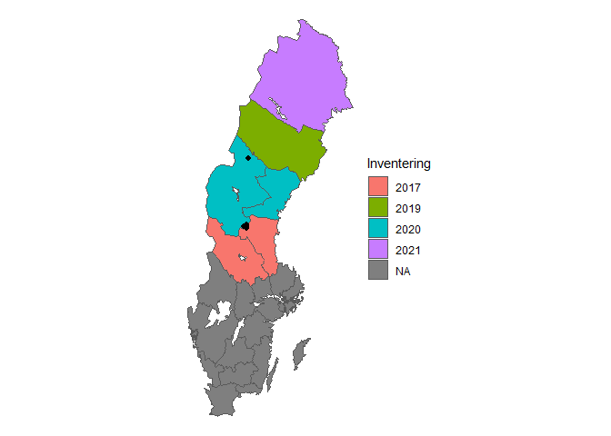

Bears Across Borders
================
Martin Andersson
2022-01-29

    ## [1] "Male"

    ## [1] "Poisson maximum likelihood estimate"

    ## [1] 3.973513

    ## [1] "Zero Truncated Poisson maximum likelihood estimate"

    ## [1] 3.737005

    ## [1] "Average Ratio of Territory inside Sweden"

    ## [1] 0.6601298

    ## [1] "Product of Average Ratio inside Sweden and Zero Truncated Poisson Estimate"

    ## [1] 2.466908

    ## [1] ""

    ## [1] ""

    ## [1] "Female"

    ## [1] "Poisson maximum likelihood estimate"

    ## [1] 14.1414

    ## [1] "Zero Truncated Poisson maximum likelihood estimate"

    ## [1] 14.14139

    ## [1] "Average Ratio of Territory inside Sweden"

    ## [1] 0.8730925

    ## [1] "Product of Average Ratio inside Sweden and Zero Truncated Poisson Estimate"

    ## [1] 12.34674

| sex   | Region1 | Region2 |  Region3 | Region4 | RegionSweden | RegionOther |
|:------|--------:|--------:|---------:|--------:|-------------:|------------:|
| Hane  | 162.795 | 194.026 |  397.128 |  90.414 |      844.306 |     434.694 |
| Hona  | 349.128 | 278.704 |  781.766 | 167.209 |     1576.805 |     229.195 |
| Total | 511.923 | 472.730 | 1178.894 | 257.623 |     2421.111 |     663.889 |

``` r
map %>% ggplot() + geom_sf(aes(fill = Inventering)) + theme_void() +
  geom_point(data = captures %>% filter(id == "BI041000 ZF-108"), 
             aes(x = lon, y = lat, size=I(2),stroke=I(0),shape=I(16))) +
  labs(title = "Territory Size")
```

<!-- -->

``` r
captures %>%
  group_by(id) %>%
  mutate(n=n())
```

    ## # A tibble: 11,952 x 7
    ## # Groups:   id [3,076]
    ##     year date                id                      sex      lon     lat     n
    ##    <dbl> <dttm>              <chr>                   <chr>  <dbl>   <dbl> <int>
    ##  1  2015 2015-08-22 00:00:00 BI041079 ZF-195 +       Hona  508175 6944989    17
    ##  2  2015 2015-08-21 00:00:00 BI407294 Z15-564        Hona  493454 6969796    14
    ##  3  2015 2015-08-21 00:00:00 BI406693 Y15-204        Hona  633778 7064965    18
    ##  4  2015 2015-08-21 00:00:00 BI407131 Z15-401        Hona  471186 6887477     5
    ##  5  2015 2015-08-22 00:00:00 BI406943 Z15-213        Hona  507902 6946007     7
    ##  6  2015 2015-08-21 00:00:00 BI406721 Y15-232        Hane  512539 6932436     4
    ##  7  2015 2015-08-21 00:00:00 BI080325 X12-130        Hane  554392 6997702     3
    ##  8  2015 2015-08-22 00:00:00 BI406608 Y15-119 +      Hona  562691 7032321     4
    ##  9  2015 2015-08-21 00:00:00 BI041205 ZF-323 Z15-294 Hona  448970 6846702     1
    ## 10  2015 2015-08-21 00:00:00 BI407055 Z15-325 +      Hane  545853 7067272    19
    ## # ... with 11,942 more rows

``` r
captures %>%
  filter(id == "BI041079 ZF-195 +")
```

    ## # A tibble: 17 x 6
    ##     year date                id                sex      lon     lat
    ##    <dbl> <dttm>              <chr>             <chr>  <dbl>   <dbl>
    ##  1  2015 2015-08-22 00:00:00 BI041079 ZF-195 + Hona  508175 6944989
    ##  2  2015 2015-08-29 00:00:00 BI041079 ZF-195 + Hona  508382 6958888
    ##  3  2015 2015-08-29 00:00:00 BI041079 ZF-195 + Hona  507744 6941276
    ##  4  2015 2015-09-19 00:00:00 BI041079 ZF-195 + Hona  508379 6962180
    ##  5  2015 2015-09-19 00:00:00 BI041079 ZF-195 + Hona  508592 6961572
    ##  6  2015 2015-09-19 00:00:00 BI041079 ZF-195 + Hona  509652 6952554
    ##  7  2015 2015-09-08 00:00:00 BI041079 ZF-195 + Hona  502831 6960716
    ##  8  2015 2015-10-31 00:00:00 BI041079 ZF-195 + Hona  513416 6958123
    ##  9  2015 2015-10-21 00:00:00 BI041079 ZF-195 + Hona  515102 6951474
    ## 10  2015 2015-10-17 00:00:00 BI041079 ZF-195 + Hona  507431 6965059
    ## 11  2015 2015-10-16 00:00:00 BI041079 ZF-195 + Hona  508883 6960184
    ## 12  2015 2015-10-16 00:00:00 BI041079 ZF-195 + Hona  514110 6950991
    ## 13  2015 2015-10-18 00:00:00 BI041079 ZF-195 + Hona  508354 6964857
    ## 14  2015 2015-10-16 00:00:00 BI041079 ZF-195 + Hona  509168 6960171
    ## 15  2015 2015-10-16 00:00:00 BI041079 ZF-195 + Hona  507309 6964681
    ## 16  2015 2015-10-06 00:00:00 BI041079 ZF-195 + Hona  506008 6961394
    ## 17  2015 2015-10-06 00:00:00 BI041079 ZF-195 + Hona  505997 6961384

``` r
capturesFemale
```

    ## # A tibble: 1,806 x 6
    ## # Groups:   id [1,806]
    ##    id                      sex   meanlon  meanlat DistanceFromMean     n
    ##    <chr>                   <chr>   <dbl>    <dbl>            <dbl> <int>
    ##  1 BI407294 Z15-564        Hona  499372. 6976594.             9013    14
    ##  2 BI407131 Z15-401        Hona  465078  6888054.             6135     5
    ##  3 BI041205 ZF-323 Z15-294 Hona  448970  6846702                 0     1
    ##  4 BI406935 Z15-205 +      Hona  564044  7096505              1155     2
    ##  5 BI407060 Z15-330        Hona  452803  6838966              2989     2
    ##  6 BI407093 Z15-363        Hona  546785  7049658                 0     1
    ##  7 BI406946 Z15-216 +      Hona  465297  7033731.             5170     9
    ##  8 BI406951 Z15-221 +      Hona  487090. 7066947.            19198     5
    ##  9 BI407101 Z15-371        Hona  496377. 7074753.            16503     9
    ## 10 BI407006 Z15-276        Hona  413637. 6927788             33271     3
    ## # ... with 1,796 more rows

Introduction

*Why are we doing this?*

-Bear Inventory has been performed for several years. -Hunting quotas
are set at a regional level. -Studying bias from double counting bears.
-Estimating number of bears in each of the four regions.

*What have been done (literature review)?*
</li>

-   

-kindberg2011estimating

*How will we approach the problem?*

-Simple model that can be applied to all samples. -Number of spills
poisson distributed. -Bear territory a circle of specified size.

***First Draft***

For several years now the Swedish museum of natural history has been
performing an inventory of the brown bear population in the northern
half of Sweden. The region has been divided into four parts and every
year a different part is investigated and every fifth year no
investigations are performed. The investigation is done by soliciting
hunters among others to collect stool samples from bear that they find
in the forest and send it in for DNA analysis along with information on
where the sample was found.Conventional statistical methods have been
performed on the supplied data and estimated have been made over the
years but now more specific type of analysis has been requested.

(***WRITE SOMETHING ABOUT THE KINDBERG ARTICLE***)

Brown Bears have very large areas that they wander through and pay no
heed to the borders specified by humans. As such a bear might be found
in two different areas in two different years which can cause a bear to
be counted in both areas. This is a problem since hunting quotas are not
set at a national level but a regional level and as such knowing the
exact number of bears in each area is important. As such the purpouse of
my project is to estimate the bias introduced by double counting bears
and also create my own estimate of the total numbers of bears in each
area.

As a large number of bears have only been observed a single time and a
large number of bears have not been observed at all, trying to apply a
standard model for estimating the size and shape of a bears area is
going to be difficult if not impossible. As such for the sample at hand
i will be applying a simplified model that can be applied to all bears
independant of the number of samples we have from each. I will also be
performing a simulation study in which i will be using a more realistic
model for the size and shape of the bears territories. I will be making
the assumption that the number of samples from each bear follows a
poisson distribution and combined with the model on the bears areas i
will estimate the number of bears in each region.

(***Standardize choice of words***)

-Bears Territory/Bears Area

-Area/Region

***Method***

*What tools are we going to use:*

-Rstudio

*Statistical models and assumptions.*

-Poisson Model for number of samples found from each bear which can also
be used to estimate total number of bears.

-Simple model for size of territory (circle of constant size) along with
more complicated one for simulation studies (Bivariate normal) *How are
we going to estimate parameters?*

-Maximum likelihood. *Do we need numerical methods?*

-Numerical Methods for calculating the ratio of a bears territory lies
on which side of the border.

*Results*

-   

*Discussion*

-Try to collect samples from outside Sweden as well.

*References*

-bibtex file

    ## 
    ## To cite R in publications use:
    ## 
    ##   R Core Team (2021). R: A language and environment for statistical
    ##   computing. R Foundation for Statistical Computing, Vienna, Austria.
    ##   URL https://www.R-project.org/.
    ## 
    ## A BibTeX entry for LaTeX users is
    ## 
    ##   @Manual{,
    ##     title = {R: A Language and Environment for Statistical Computing},
    ##     author = {{R Core Team}},
    ##     organization = {R Foundation for Statistical Computing},
    ##     address = {Vienna, Austria},
    ##     year = {2021},
    ##     url = {https://www.R-project.org/},
    ##   }
    ## 
    ## We have invested a lot of time and effort in creating R, please cite it
    ## when using it for data analysis. See also 'citation("pkgname")' for
    ## citing R packages.
