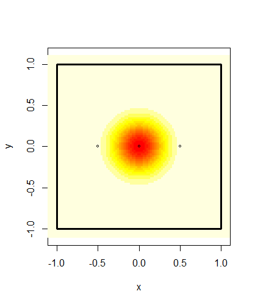
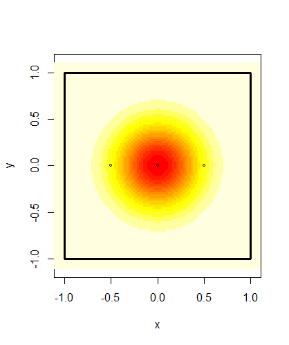
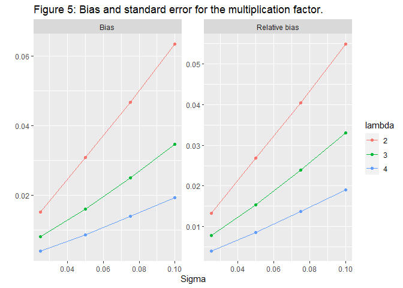
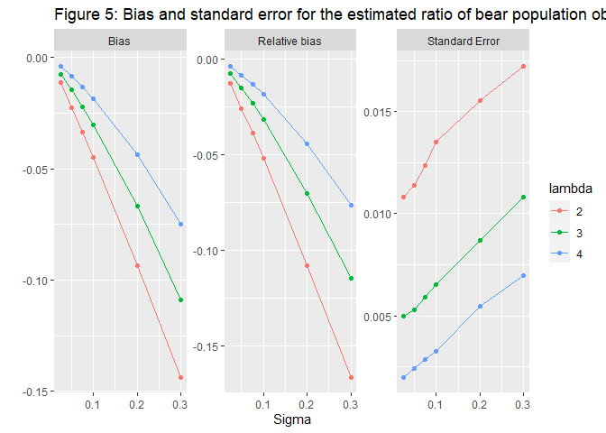
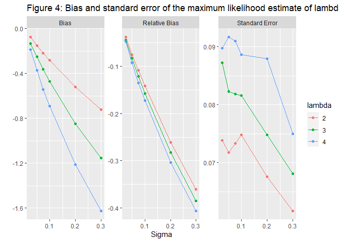

Bears Across Borders
================
Martin Andersson
2022-01-29

    ## [1] "Sigma = 0.025"

<!-- -->

    ## [1] "Sigma = 0.1"

<!-- -->

    ## [1] "Sigma = 0.2"

<!-- -->

    ## [1] "Sigma = 0.3"

<!-- --><!-- --><!-- --><!-- --><!-- --><!-- -->

***Introduction***

***EXPLAINING THE BEAR INVENTORY***

For several years now the population size and trends of brown bears in
four regions of Sweden have and continues to be monitored. The total
population and how it changes over time is important for conservation
efforts and the setting of hunting quotas. If the hunting quotas are too
large the survival of the brown bear species could be in jeopardy. On
the opposite if it is too low the population could grow large enough to
cause problems in the eco system or for the local human population.

***HOW IT WAS COLLECTED***

The monitoring and estimation of the bear population is done through the
collection of scat samples. The collection is done by volunteers and
genotypes are identified through dna analysis and used to get an
estimate of the number of bears from which a scat sample has been
obtained. We also expect that for a certain number of bears no samples
will be found and as such the population of such bears must be estimated
statistically.

The collection of spill samples takes place over 5 years in which spill
samples are collected in one region each year in order with the fifth
year is an off year when no collection takes place. The samples are
collected over 11 weeks in which the volunteers notes down the location
of the spill and collects a small piece to send in for DNA analysis.

Region 1 consists of both Gävleborg and Dalarna,Region 2 is
Västerbottenslän, Region 3 consists of both Västernorrlandslän and
Jämtland , and Region 4 is Norrbottenslän

The estimation of the total bear population is currently modeled using
the Capture-Mark-Recapture method. A full explanation of the methods
used can be found in Kindberg2011.

***PROBLEMS***

A problem with the division of Sweden into Regions in this way is that
brown bears do not care for these arbitrary borders. A bear could be
found on one side of the border one year and the other in another year.
Should this happen the bear would be counted twice for the census of the
total population in Sweden which introduces bias to the estimation.

Another problem with this is deciding which region a bear belongs to.
One could assume that each bear has a territory throughout which it
wanders regularly. Whichever region contains the largest share of this
territory or that contains the territories midpoint could be considered
the bears home region. Another method would be counting the bear as the
ratio of its territory that lies within each region.

Male brown bears, especially young ones are known to wander freely and
it is not unthinkable that their territory changes dramatically between
years.

Trying to estimate a bears territory only using the location of scat
samples is difficult. For bears which only a single sample has been
found you can only get a rough idea of where that bears territory is
located. For the bears that no samples were discovered there is no way
to assign them a territory.

Another complication with the border problem is how it affects the
numbers of samples found for each bear. To estimate the number of bears
for which zero samples are found the rate at which samples are found
needs to be estimated. The rate is assumed to be constant for each bear
but due to the way the collection of samples is performed only samples
inside the region currently being sampled can be found. As such a bear
that has its territory close to the border is going to have their
samples found at a lower rate causing bias in the estimation of the rate
and therefore also in the estimation of the number of bears with zero
samples found.

The impact of these various sources of bias on the estimate of the bear
populations do vary depending on what the actual rate of samples found
and the size of the bears territories are. Should the rate of found
samples be very high the number of bears for which zero samples are
found will be close to zero. If bears have very small territories then
the probability that a bears territory will span several regions is also
very low.

***HOW TO INVESTIGATE PROBLEMS***

To analyse how the border problem affects the estimation of the bear
population we have performed a simulation study. By simulating a random
number of bears over a created region and varying the rate at which
samples are found and the size of bears territories the bias can be
measured and illustrated.

***CONCLUSIONS***

Using the simulation study we concluded that the bias in the population
estimate scales close to linearly with the size of the bears
territories. For very small territories the population estimate exceeds
the true population by somewhere between 5 and 10 percent with only
minor differences in bias for different simulated rates of discovered
samples. Should however the territory be much larger the population
estimate could exceed the true population by over 60%.

The main source of this bias comes from the bears from outside the
inventoried region. The amount of bears from outside that are observed
grow as territory sizes grow and the among all observed bears between 5
to 40% of them could be from outside. The amount of outside bears also
increases noticeably as the rate of found samples increase.

Estimating the rate at which samples are left by bears was found to be
biased as well. As the rate of samples found and as the bears
territories increase, the bias in the estimate increase as well. Since
we can’t get an accurate estimate of this rate it is difficult to
estimate the population estimate bias from a real world sample in which
the rate is unknown.

***Method***

We will be using the R language with RStudio to perform all
calculations. The package tidyverse will be used for data management.

***STATISTICAL MODELS AND ASSUMPTIONS***

For any area we are performing an inventory on *S*, we define the area
that lies within distance *l* from the border of *S* as *O* and *W* as
the union of *S* and *O*. Both *S* and *O* have different bear
populations but with the same population density.

The number of samples that each bear *b**i* leaves is
*K**i* ∼ *P**o**i**s**s**o**n*(*λ*0). Each sample
*k**i**j* has a location that is bivariate normally
distributed $N(\\textbf \\mu\_{i}, \\sigma I)$ where . We assume the
distribution function for this bivariate normal distribution
*T**i* to be the shape of the bears territory. The bear
spends more time closer to the midpoint than further away from it.

If *k**i**j* ∈ *S* then it will be observed with probability
*p* and if *k**i**j* ∉ *S* then the probability of it being
observed is zero. Let $I_i = \\int\_{S}T_id \\textbf x$ then the number
of samples that *b**i* leaves inside *S* is
*K**S**i* ∼ *P**o**i**s**s**o**n*(*I**i**λ*0)
distributed. Since these samples are only observed with probability *p*
the distribution for the number of samples observed by *b**i*
is binomially distributed *B*(*K**S**i*,*p*) which is a
conditional distribution. The binomial distribution where the number of
repetitions is conditioned on the outcome of a poisson distributed
variable is also poisson distributed so
*B*(*K**S**i*,*p*) ∼ *P**o**i**s**s**o**n*(*p**I**i**λ*0).
As we are not specifically interested in neither *p* nor
*l**a**m**b**d**a*0 we can replace *p**λ*0 with
*λ* and focus only on the rate at which samples are observed. Therefore
the number of observed samples left by *b**i* is
*O**i* ∼ *P**o**i**s**s**o**n*(*I**i**λ*).

***HOW IT IS SIMULATED***

For this simulation *W* is a 9 x 9 square with center in origo of the
two dimensional Cartesian plane and *S* is the 2 x 2 square centred
around origo. We want *S* and *O* to have the same average population
density and since *S* has an area of 4 square units and *W* has an area
of 36 that is 9 times larger we simulate the population of *W* from a
*p**o**i**s**s**o**n*(9*μ*) distribution where *μ* is the mean
population size of *S*. The reason the poisson distribution was chosen
for the population size is because for large mean the distribution is
close to a normal distribution but discrete.

To keep it simple the bears are uniformly distributed throughout *W*. As
such each simulated bear *b**i* has a territory midpoint
*μ**i* = (*X**i*,*Y**i*) ∼ (*U*−3, 3,*U*−3, 3).
Any bear whose midpoint lies within *S* is marked as a “True Bear” and
the rest as “False bears.” The total number of “True bears” *N* is what
we are trying to estimate so for each simulation we include this total.
For each *b**i* we simulate the number of samples they leave
from a *P**o**i**s**s**o**n*(*λ*) distribution. Each simulated sample
then has its location simulated from the bivariate normal distribution
*N*(*m**u**i*,*σ**I*). Any sample that is not contained in
*S* is then removed and then any bear with zero remaining samples is
also removed and the remaining samples are considered observed. The
number of True bears and False Bears for which at least one sample has
been observed is then counted.

*λ* is estimated using the maximum likelihood estimate for a zero
truncated poisson distribution since we cannot observe the bears with
zero samples observed.

Let *N**O**b**s* be the number of bears observed,
*N**O**b**s**T**r**u**e* be the number of bears observed whose midpoint
actually belong to *S* and *N**O**b**s**F**a**l**s**e* be the number of
bears observed whose midpoint does not belong to *S*.

The estimate for the total number of bears in *S* is then.

$$\\hat N =\\frac {NObs}{1-e^{\\hat \\lambda}}$$
However this is done under the assumption that
*N**O**b**s* = *N**O**b**s**T**r**u**e*. However in actuality

*N**O**b**s* = *N**O**b**s**T**r**u**e* + *N**O**b**s**F**a**l**s**e*

Which means that

$$\\hat N =\\frac {NObsTrue + NObsFalse}{1-e^{\\hat \\lambda}}$$

Since we measure the true value of *N* we can measure the bias *N̂* − *N*
and analyse it.

For the simulation values of *λ* and *σ*, values close to the ones
observed for the bear census were used.

For *λ* we use values 2, 3 and 4 and for *σ* we use 0.025, 0.05, 0.075,
0.1, 0.2 and 0.3.

***Results***

In Figure 1 we can see how the bias in the population estimate bias
grows seemingly linearly as *σ* grows while changes in *λ* adjusts the
slope coefficient. As *σ* approaches zero each bears territory converges
towards a single point, that being the midpoint of the territory. When
the bears territories are that small the probability that a any bears
territory will intersect with a region that the bear does not belong to
is negligible and all bears will only leave spills inside their own
region. However for large *σ* the relative bias is quite high with the
estimate possibly being more than 60% larger than the true population.

<!-- -->

<!-- -->

***Discussion***

# What conclusions can we draw from results?

# Future directions for research.

The model used to reach these conclusions are based on several
simplifying assumptions. The assumption that bears have clearly defined
territories is doubtful specifically for the male bears.

A possible way to identify bears from outside the region that is being
censused would be to extend the search for samples some distance outside
the region.

As the collection is done by volunteers we only have samples collected
from where they went. As such the border of the region being inventoried
is not neccesarily the regions borders but the border of the area that
at least one volunteer has passed through.

***Appendix***

<!-- -->

<!-- -->

#Include link to github repository.

<https://github.com/Martin4188/Bears-Across-Borders>

***References***

-bibtex file

    ## 
    ## To cite R in publications use:
    ## 
    ##   R Core Team (2021). R: A language and environment for statistical
    ##   computing. R Foundation for Statistical Computing, Vienna, Austria.
    ##   URL https://www.R-project.org/.
    ## 
    ## A BibTeX entry for LaTeX users is
    ## 
    ##   @Manual{,
    ##     title = {R: A Language and Environment for Statistical Computing},
    ##     author = {{R Core Team}},
    ##     organization = {R Foundation for Statistical Computing},
    ##     address = {Vienna, Austria},
    ##     year = {2021},
    ##     url = {https://www.R-project.org/},
    ##   }
    ## 
    ## We have invested a lot of time and effort in creating R, please cite it
    ## when using it for data analysis. See also 'citation("pkgname")' for
    ## citing R packages.

    ## 
    ##   Wickham et al., (2019). Welcome to the tidyverse. Journal of Open
    ##   Source Software, 4(43), 1686, https://doi.org/10.21105/joss.01686
    ## 
    ## A BibTeX entry for LaTeX users is
    ## 
    ##   @Article{,
    ##     title = {Welcome to the {tidyverse}},
    ##     author = {Hadley Wickham and Mara Averick and Jennifer Bryan and Winston Chang and Lucy D'Agostino McGowan and Romain François and Garrett Grolemund and Alex Hayes and Lionel Henry and Jim Hester and Max Kuhn and Thomas Lin Pedersen and Evan Miller and Stephan Milton Bache and Kirill Müller and Jeroen Ooms and David Robinson and Dana Paige Seidel and Vitalie Spinu and Kohske Takahashi and Davis Vaughan and Claus Wilke and Kara Woo and Hiroaki Yutani},
    ##     year = {2019},
    ##     journal = {Journal of Open Source Software},
    ##     volume = {4},
    ##     number = {43},
    ##     pages = {1686},
    ##     doi = {10.21105/joss.01686},
    ##   }

    ## 
    ## To cite the 'knitr' package in publications use:
    ## 
    ##   Yihui Xie (2021). knitr: A General-Purpose Package for Dynamic Report
    ##   Generation in R. R package version 1.34.
    ## 
    ##   Yihui Xie (2015) Dynamic Documents with R and knitr. 2nd edition.
    ##   Chapman and Hall/CRC. ISBN 978-1498716963
    ## 
    ##   Yihui Xie (2014) knitr: A Comprehensive Tool for Reproducible
    ##   Research in R. In Victoria Stodden, Friedrich Leisch and Roger D.
    ##   Peng, editors, Implementing Reproducible Computational Research.
    ##   Chapman and Hall/CRC. ISBN 978-1466561595
    ## 
    ## To see these entries in BibTeX format, use 'print(<citation>,
    ## bibtex=TRUE)', 'toBibtex(.)', or set
    ## 'options(citation.bibtex.max=999)'.

    ## 
    ## To cite 'polyCub' in publications, please refer to:
    ## 
    ## Meyer S (2019). "polyCub: An R package for Integration over Polygons."
    ## _Journal of Open Source Software_, *4*(34), 1056. ISSN 2475-9066, doi:
    ## 10.21105/joss.01056 (URL: https://doi.org/10.21105/joss.01056).
    ## 
    ## A BibTeX entry for LaTeX users is
    ## 
    ##   @Article{R:polyCub,
    ##     author = {Sebastian Meyer},
    ##     title = {{polyCub}: An {R} package for Integration over Polygons},
    ##     journal = {Journal of Open Source Software},
    ##     issn = {2475-9066},
    ##     year = {2019},
    ##     volume = {4},
    ##     number = {34},
    ##     pages = {1056},
    ##     doi = {10.21105/joss.01056},
    ##   }
