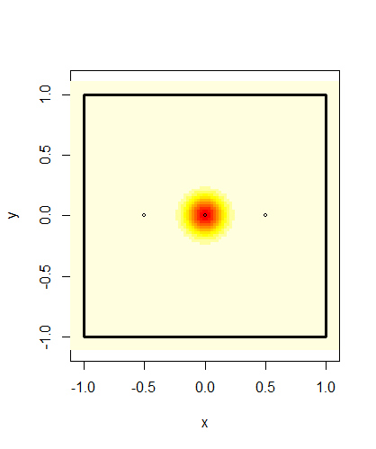
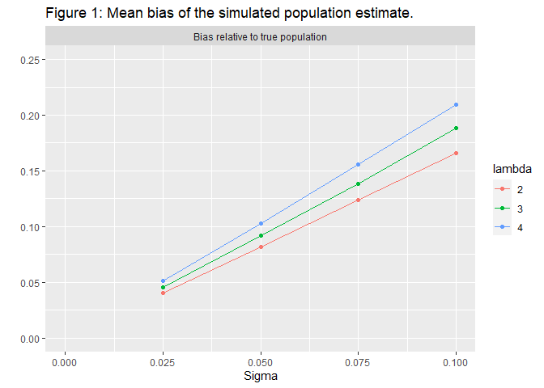
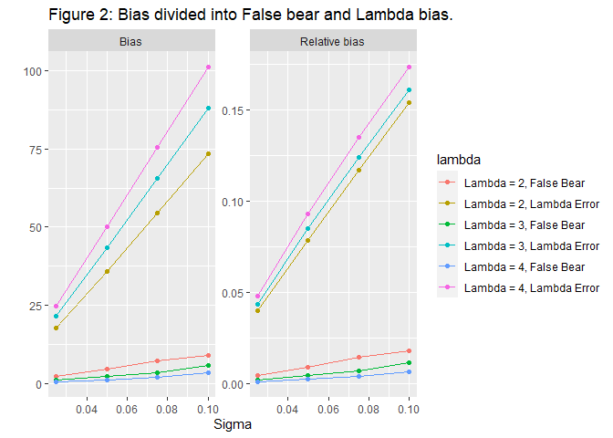
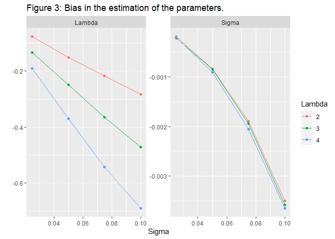
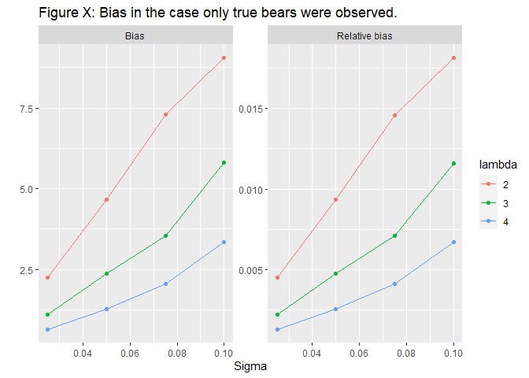
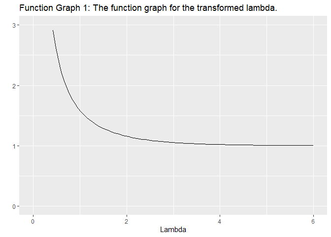

Bears Across Borders
================
Martin Andersson
2022-01-29

    ## [1] "Sigma = 0.025"

<!-- -->

    ## [1] "Sigma = 0.1"

<!-- --><!-- --><!-- --><!-- --><!-- --><!-- --><!-- -->

| year | sex   | Standard Estimate | Alt Estimate | Ratio Estimate | Standard Lambda | Alt Lambda | Normalized Sigma |
|:-----|:------|------------------:|-------------:|---------------:|----------------:|-----------:|-----------------:|
| 2015 | Hane  |          438.9666 |     437.2374 |       419.2321 |        4.706508 |   4.905714 |        0.0762118 |
| 2015 | Hona  |          594.2778 |     592.4432 |       569.7841 |        3.801252 |   3.946863 |        0.0574793 |
| 2015 | Total |         1033.2444 |    1029.6805 |       989.0162 |              NA |         NA |               NA |
| 2016 | Hane  |          143.5283 |     140.1657 |       136.7642 |        2.438544 |   2.529981 |        0.0654466 |
| 2016 | Hona  |          225.3331 |     223.2975 |       219.6450 |        2.405327 |   2.448531 |        0.0432451 |
| 2016 | Total |          368.8614 |     363.4631 |       356.4092 |              NA |         NA |               NA |
| 2017 | Hane  |          272.2243 |     259.0285 |       248.5888 |        3.188547 |   3.356554 |        0.0669158 |
| 2017 | Hona  |          390.7397 |     386.9825 |       374.3613 |        3.211857 |   3.320572 |        0.0518495 |
| 2017 | Total |          662.9639 |     646.0110 |       622.9501 |              NA |         NA |               NA |
| 2019 | Hane  |          176.2526 |     173.7480 |       165.3290 |        2.025502 |   2.125154 |        0.0915389 |
| 2019 | Hona  |          228.2444 |     224.1914 |       212.1645 |        1.840133 |   1.940800 |        0.0656059 |
| 2019 | Total |          404.4969 |     397.9395 |       377.4935 |              NA |         NA |               NA |
| 2020 | Hane  |          440.1865 |     438.4731 |       422.6845 |        3.434908 |   3.559724 |        0.0657033 |
| 2020 | Hona  |          764.4728 |     759.9292 |       736.3503 |        3.042619 |   3.138866 |        0.0439210 |
| 2020 | Total |         1204.6593 |    1198.4023 |      1159.0348 |              NA |         NA |               NA |

| year | sex   | Standard Estimate | Alt Estimate | Ratio Estimate | Simulated Unbiased Estimate | Estimated Simulated Bias | Simulated Bias Estimate |
|:-----|:------|------------------:|-------------:|---------------:|----------------------------:|-------------------------:|------------------------:|
| 2015 | Hane  |          438.9666 |     437.2374 |       419.2321 |                    375.1851 |                 63.78148 |                    0.17 |
| 2015 | Hona  |          594.2778 |     592.4432 |       569.7841 |                    530.6052 |                 63.67262 |                    0.12 |
| 2015 | Total |         1033.2444 |    1029.6805 |       989.0162 |                    905.7903 |                127.45410 |                      NA |
| 2016 | Hane  |          143.5283 |     140.1657 |       136.7642 |                    128.1502 |                 15.37803 |                    0.12 |
| 2016 | Hona  |          225.3331 |     223.2975 |       219.6450 |                    210.5917 |                 14.74142 |                    0.07 |
| 2016 | Total |          368.8614 |     363.4631 |       356.4092 |                    338.7420 |                 30.11945 |                      NA |
| 2017 | Hane  |          272.2243 |     259.0285 |       248.5888 |                    240.9064 |                 31.31784 |                    0.13 |
| 2017 | Hona  |          390.7397 |     386.9825 |       374.3613 |                    358.4768 |                 32.26291 |                    0.09 |
| 2017 | Total |          662.9639 |     646.0110 |       622.9501 |                    599.3832 |                 63.58075 |                      NA |
| 2019 | Hane  |          176.2526 |     173.7480 |       165.3290 |                    153.2631 |                 22.98947 |                    0.15 |
| 2019 | Hona  |          228.2444 |     224.1914 |       212.1645 |                    207.4949 |                 20.74949 |                    0.10 |
| 2019 | Total |          404.4969 |     397.9395 |       377.4935 |                    360.7580 |                 43.73895 |                      NA |
| 2020 | Hane  |          440.1865 |     438.4731 |       422.6845 |                    389.5456 |                 50.64092 |                    0.13 |
| 2020 | Hona  |          764.4728 |     759.9292 |       736.3503 |                    701.3512 |                 63.12161 |                    0.09 |
| 2020 | Total |         1204.6593 |    1198.4023 |      1159.0348 |                   1090.8968 |                113.76253 |                      NA |

***Introduction***

***EXPLAINING THE BEAR INVENTORY***

For several years now the population size and trends of brown bears in
four regions of Sweden have and continues to be monitored. The total
population and how it changes over time is important for conservation
efforts and the setting of hunting quotas. If the hunting quotas are too
large the survival of the brown bear species could be in jeopardy. On
the opposite if it is too low the population could grow large enough to
cause problems in the eco-system or for the local human population.

***HOW IT WAS COLLECTED***

The monitoring and estimation of the bear population is done through the
collection of scat samples. The collection is done by volunteers and
genotypes are identified through DNA analysis and used to get an
estimate of the number of bears from which a scat sample has been
obtained. We also expect that for a certain number of bears no samples
will be found and as such the population of such bears must be estimated
statistically.

The collection of spill samples takes place over 5 years in which spill
samples are collected in one region each year in order with the fifth
year is an off year when no collection takes place. The samples are
collected over 11 weeks in which the volunteers notes down the location
of the spill and collects a small piece to send in for DNA analysis.

Region 1 consists of both Gävleborg and Dalarna,Region 2 is
Västerbottenslän, Region 3 consists of both Västernorrlandslän and
Jämtland, and Region 4 is Norrbottenslän

The estimation of the total bear population is currently modeled using
the Capture-Mark-Recapture method. Traditionally the
Capture-Mark-Recapture method involved physically capturing the animals
in question but with advancements in DNA analysis it is now possible to
perform the analysis by just “capturing” the DNA of the animals instead.
While similar the underlying models at work are quite different. When
collecting scat samples for example there is no beforehand known upper
limit to the number of “captures” like there might be when using traps.
A thorough explanation of this “genetic mark-recapture” method we use
can be found in the article *“A new method for estimating the size of
small populations from genetic mark–recapture data”* by Miller et
al.,(2005).

A full explanation of the methods used in the Swedish survey be found in
*“Estimating population size and trends of the Swedish brown bear Ursus
arctos population”* Kindberg et al.,(2011).

***PROBLEMS***

A problem with the division of Sweden into regions in this way is that
brown bears do not care for these arbitrary borders. A bear could be
found on one side of the border one year and the other in another year.
Should this happen the bear would be counted twice for the census of the
total population in Sweden which introduces bias to the estimation.

Another problem with this is deciding which region a bear belongs to.
One could assume that each bear has a territory throughout which it
wanders regularly. Whichever region contains the largest share of this
territory or that contains the territories midpoint could be considered
the bears home region. Another method would be counting the bear as the
ratio of its territory that lies within each region. Male brown bears,
especially young ones are known to wander freely and it is not
unthinkable that their territory changes dramatically between years.

Trying to estimate a bears territory only using the location of scat
samples is difficult. For bears which only a single sample has been
found you can only get a rough idea of where that bears territory is
located. For the bears that no samples were discovered there is no way
to assign them a territory.

Another complication with the border problem is how it affects the
numbers of samples found for each bear. To estimate the number of bears
for which zero samples are found the rate at which samples are found
needs to be estimated. The rate is assumed to be constant for each bear
but due to the way the collection of samples is performed only samples
inside the region currently being sampled can be found. As such a bear
that has its territory close to the border is going to have their
samples found at a lower rate causing bias in the estimation of the rate
and therefore also in the estimation of the number of bears with zero
samples found.

The impact of these various sources of bias on the estimate of the bear
populations do vary depending on what the actual rate of samples found
and the size of the bears territories are. Should the rate of found
samples be very high the number of bears for which zero samples are
found will be close to zero. If bears have very small territories then
the probability that a bears territory will span several regions is also
very low.

The method capture-recapture methods that take the positions of animals
into account is referred to as spacial capture-recapture and in this
case it would specifically be spatial genetic mark-recapture methods. A
thorough explanation of why and how spatial methods are useful can be
found in *“Unifying population and landscape ecology with spatial
capture–recapture”* Royle et al., (2018).

***HOW TO INVESTIGATE PROBLEMS***

To analyse how the border problem affects the estimation of the bear
population we have performed a simulation study. By simulating a random
number of bears over a created region and varying the rate at which
samples are found and the size of bears territories the bias can be
measured and illustrated.

The simulation values will be chosen based on the values observed for
the Swedish survey samples. A calculation heavy method will also be
utilized on the Swedish survey samples as well to get an alternative
estimate for the population. which can be compared to the bias observed
for the simulated samples.

***CONCLUSIONS***

Using the simulation study we concluded that the bias in the population
estimate scales close to linearly with the size of the bears
territories. For very small territories the population estimate exceeds
the true population by somewhere between 5 and 10 percent with only
minor differences in bias for different simulated rates of discovered
samples. Should however the territory be much larger the population
estimate could exceed the true population by over 60%.

The main source of this bias comes from the bears from outside the
inventoried region. The amount of bears from outside that are observed
grow as territory sizes grow and the among all observed bears between 5
to 40% of them could be from outside. The amount of outside bears also
increases noticeably as the rate of found samples increase.

Estimating the size of the territories as well as the rate at which
samples are left by bears was found to be biased as well. As the rate of
samples found and as the bears territories increase, the bias in the
estimates increase as well. Since we can’t get an accurate estimate of
these parameters it is difficult to make an exact estimate of the mean
population estimate bias from a real world sample in which the rate is
unknown.

Applying the results of the simulation study to the Swedish survey the
bias for each region was estimated to lay somewhere inbetween 5-13%

***Acknowledgments***

I would like to thank Martin Sköld for his advice and guidance.

***Method***

We will be using the R language with RStudio to perform all
calculations. The Rstudio packages used are included in the list of
references.

***STATISTICAL MODELS AND ASSUMPTIONS***

For any area we are performing an inventory on *S*, we define the area
that lies within distance *l* from the border of *S* as *O* and *W* as
the union of *S* and *O*. Both *S* and *O* have different bear
populations but with the same population density.

In Miller et al.,(2005) a Multinomial distribution is used as a model
for the samples. The idea is that we condition on the number of samples
observed and for each sample assume that each bear has an equal
probability of expelling the sample in question. As such the number of
samples left by any bear is *B*(*M*,1/*N*) where *M* is the total number
of samples and *N* is the total population of bears in the region.
However the multinomial distribution is slightly difficult to work with
especially as due to spatial reasons the number of samples we expect to
observe from each bear is not equal for all bears. As it is easier to
work with each bear having its own independent distribution for the
number of samples it leaves we will instead assume each bear leaves
samples based on the *B*(*M*,1/*N*) distribution. Since the observed
values for *M* is relatively large and 1/*N* is relatively small we can
approximate the binomial distribution with the poisson distribution
*P**o**i**s**s**o**n*(*M*/*N*) = *P**o**i**s**s**o**n*(*λ*<sub>0</sub>).

A thorough explanation of approximating the multinomial distribution
with the poisson distribution can be read in *“On the Poisson
approximation to the multinomial distribution”* McDonald & David,
(1980).

The number of samples that bear number *i* leaves is
*K*<sub>*i*</sub> ∼ *P**o**i**s**s**o**n*(*λ*<sub>0</sub>). For each
bear that has had a sample observed the sample
*k*<sub>*i**j*</sub>, *j* = 1, ..., .*n* has a location that is
bivariate normally distributed $N(\\textbf \\mu\_{i}, \\sigma I)$ and we
let $T_i(\\textbf x)$ be the probability distribution function for this
distribution. We also use *T*<sub>*i*</sub> to describe bear *i*’s
territory. The amount of time that a bear spends during the inventory
period in any area *A* is
$\\int\_{A}^{} T_i(\\textbf x) \\,{d \\textbf x}$.

If *k*<sub>*i**j*</sub> ∈ *S* then it will be observed with probability
*p* and if *k*<sub>*i**j*</sub> ∉ *S* then the probability of it being
observed is zero. Let $I_i = \\int\_{S}T_id \\textbf x$ then the number
of samples that bear number *i* leaves inside *S* is
*K*<sub>*S**i*</sub> ∼ *P**o**i**s**s**o**n*(*I*<sub>*i*</sub>*λ*<sub>0</sub>)
distributed. Since these samples are only observed with probability *p*
the distribution for the number of samples observed by bear number *i*
is binomially distributed *B*(*K*<sub>*S**i*</sub>,*p*) which is a
conditional distribution. The binomial distribution where the number of
repetitions is conditioned on the outcome of a poisson distributed
variable is also poisson distributed so
*B*(*K*<sub>*S**i*</sub>,*p*) ∼ *P**o**i**s**s**o**n*(*p**I*<sub>*i*</sub>*λ*<sub>0</sub>).
As we are not specifically interested in neither *p* nor
*l**a**m**b**d**a*<sub>0</sub> we can replace *p**λ*<sub>0</sub> with
*λ* and focus only on the rate at which samples are observed. Therefore
the number of observed samples left by bear number *i* is
*O*<sub>*i*</sub> ∼ *P**o**i**s**s**o**n*(*I*<sub>*i*</sub>*λ*).

***HOW IT IS SIMULATED***

For this simulation *W* is a 9 x 9 square with centre in origo of the
two dimensional Cartesian plane and *S* is the 2 x 2 square centred
around origo. We want *S* and *O* to have the same average population
density and since *S* has an area of 4 square units and *W* has an area
of 36 that is 9 times larger we simulate the population of *W* from a
*p**o**i**s**s**o**n*(9*μ*) distribution where *μ* is the mean
population size of *S*.

For the location of bears midpoints in *W* we choose to use a
homogeneous poisson process throughout the plane. As such each simulated
bear number *i* has a territory midpoint
*μ*<sub>*i*</sub> = (*X*<sub>*i*</sub>,*Y*<sub>*i*</sub>) ∼ (*U*<sub>−3, 3</sub>,*U*<sub>−3, 3</sub>).
Any bear whose midpoint lies within *S* is marked as a “True Bear” and
the rest as “False bears.” The total number of “True bears” *N* is what
we are trying to estimate so for each simulation we include this total.
For each simulated bear we simulate the number of samples they leave
from a *P**o**i**s**s**o**n*(*λ*) distribution. Each simulated sample
then has its location simulated from the bivariate normal distribution
*N*(*m**u*<sub>*i*</sub>,*σ**I*). Any sample that is not contained in
*S* is then removed and then any bear with zero remaining samples is
also removed and the remaining samples are considered observed. The
number of True bears and False Bears for which at least one sample has
been observed is then counted.

*λ* is estimated using the maximum likelihood estimate for a zero
truncated poisson distribution since we cannot observe the bears with
zero samples observed.

Let *N**O**b**s* *N*<sup>obs</sup> be the number of bears observed,
*N*<sub>*T*</sub><sup>obs</sup> be the number of bears observed whose
midpoint actually belong to *S* and *N*<sub>*F*</sub><sup>obs</sup> be
the number of bears observed whose midpoint does not belong to *S*.

Since the probability that an outcome of a *P**o**i**s**s**o**n*(*λ*)
distribution is 1 or larger is (1−*e*<sup>−*λ*</sup>) then we have

*N*(1−*e*<sup>−*λ*</sup>) = *E*(*N*<sup>obs</sup>)

The estimate for the total number of bears in *S* is then.

$$\\hat N =\\frac {N^{\\text{obs}}}{1-e^{\\hat \\lambda}}$$
However this is done under the assumption that
*N*<sup>obs</sup> = *N*<sub>*T*</sub><sup>obs</sup>. However in our case

*N*<sup>obs</sup> = *N*<sub>*T*</sub><sup>obs</sup> + *N*<sub>*F*</sub><sup>obs</sup>

Which means that

$$\\hat N^{\\text{obs}} =\\frac {N^{\\text{obs}}\_T + N^{\\text{obs}}\_F}{1-e^{\\hat \\lambda}}$$

Which we could rewrite as

$$\\hat N^{\\text{obs}} =\\frac {N^{\\text{obs}}\_T + N^{\\text{obs}}\_F}{{N^{\\text{obs}}\_T}}\\frac {N^{\\text{obs}}\_T}{1-e^{\\hat \\lambda}}$$

Which gives us two factors of which the left depends on the problem
related to the number of false bears observed and the right depends on
the error in the estimation of *λ*.

Since we measure the true value of *N* we can measure the bias *N̂* − *N*
and analyse it.

For *λ* we use values 2, 3 and 4 and for *σ* we use 0.025, 0.05, 0.075,
and 0.1. These values were chosen because they are close to the ones
estimated for the Swedish sample. There is little reason to use *λ*
values higher than 4 because in our estimate of the total population
size we use the transformation 1/(1−*e*<sup>−*λ*</sup>) instead of just
*λ* by itself. When *λ* is larger than 4 the transformations value
changes very little as can be seen in the FIGURE XXX.

<!-- -->

We choose to keep *μ* at a constant value of 500 as the relative bias in
the population estimate does not change with different average
populations. A simulation was run to illustrate this and the results can
be seen in FIGURE XXX

``` r
Figure7
```

<!-- -->

***Calculation intensive methods applied to real data.***

The idea with the alternative model is to take the positions of the
bears into account when making the estimations of the underlying
parameters. Since the bears territories are binormally distributed,
estimating how much of the territories lies within a certain region
requires integrating over some irregularly shaped intersections between
the territories and the region in question the integrals needs to be
performed numerically. These numerical methods will then also be used in
combination with an optimizing functions which causes the calculations
to take a very large time when they need to be repeated thousands of
times in a simulation to get an estimate for their effectiveness. As
such these methods will only be used on the real samples and their
effect will need to be trusted based on their soundness.

***Application to Real data***

For the real data we assume that all the assumptions of the simulation
are true. Since male bears are known to wander further than female bears
and as such would have very different values of *σ* we choose to
estimate their populations separately. *σ* is estimated by removing all
bears that only have 1 samples discovered and then using the pooled
sample variance method. To make comparisons between the real data and
the simulated data we also want to get a normalized value for them both.
For this we choose to use $ / $. Since the area in the simulation is 4
we can use the value of $2\\sigma / \\sqrt{Region Area}$ to make
comparisons between the real data and the simulation.

The midpoint coordinates of each bear is estimated as the mean of the
samples lateral and longitudal coordinates. The midpoints are going to
be biased since all samples are located inside the region so to account
for that we will apply an optimizing function to each bear. We find the
midpoint *μ* that optimize the function

$$l(\\mu) = \\sum\_{1}^{n} log(\\phi ((x_i - \\mu) / \\sigma)) / \\int\_{S}^{} \\phi ((x - \\mu) / \\sigma) \\,dx$$

where *x*<sub>*i*</sub> is the location of the bear in questions sample
*i* and *ϕ* is the standard bivariate normal distribution. The function
applies a penalty to midpoints further from the border which allows
midpoints from outside the region in question to be possible outcomes.

After each bears midpoint has been adjusted we can calculate
*I*<sub>*i*</sub> (The integral of the bears territory over the Region)
and then get the maximum likelihood estimate for *λ* where each bears
number of samples found is assumed to be a outcome of
*P**o**i**s**s**o**n*(*I*<sub>*i*</sub>*λ*<sub>0</sub>).

For the estimate of the bear population we have thought of two different
methods for the estimate. The first is to simply remove any bear whose
midpoint was adjusted to lie outside the region and then use *λ̂* to
estimate the number of bears for which zero samples were discovered. The
second is instead of summing up the discovered bears, we instead sum up
*I*<sub>*i*</sub> which means we are counting the fraction of the bears
estimated territory that lies within the region and assume that the
remainder 1 − *I*<sub>*i*</sub> belongs to another region. The number of
bears for which zero samples were found is then estimated the same as in
the first method.

***Results***

In Figure 1 we can see how the bias in the population estimate bias
grows seemingly linearly as *σ* grows while changes in *λ* adjusts the
slope coefficient. As *σ* approaches zero each bears territory converges
towards a single point, that being the midpoint of the territory. When
the bears territories are that small the probability that a any bears
territory will intersect with a region that the bear does not belong to
is negligible and all bears will only leave spills inside their own
region. However for large *σ* the relative bias is quite high with the
estimate possibly being more than 60% larger than the true population.

In Figure 2 we see that the mean number of false bears that are observed
in each sample also grows seemingly linearly with *σ* and again *λ*
adjusts the slope coefficient. Even for relatively small *σ* the number
of observed bears that are false can be as large as 10% of the observed
population.

Using the results of the simulation it would theoretically be possible
to estimate the bias for any estimation made using this method. However
to do this we would need to be able to accurately estimate the
underlying parameters *λ* and *σ*. In figure 3 we can see the bias for
the pooled sample variance estimate of *σ* and how it varies depending
on *λ* and *σ*. The magnitude of the relative bias does increase
linearly with *σ* but for smaller values the estimate is relatively
close. The bias is seemingly not influenced at all by the value of *λ*.

For the estimate of *λ* we instead choose to look at the bias in the
transformed version 1/(1−*e*<sup>−*λ*</sup>) as it also factor that we
multiply the number of observed bears with to make our total population
estimate. We can see from figure 4 how the bias grows in magnitude with
as *σ* grows. The estimate is also biased for all values of *σ*. Since
both the estimate for *σ* and *λ* are biased we cannot use the mean bias
estimated through the simulation to make an exact adjustment of a real
samples population estimate.

<!-- -->

Figure 1 shows how the mean bias in the population estimate grows
seemingly linearly as *σ* (The size of the bears territories) grows. The
mean bias grows faster as the value of *λ* (The rate at which samples
are discovered) increases.

<!-- -->

Figure 2 shows the bias divided into 2 categories. The lambda error
$\\frac {N^{\\text{obs}}\_T}{1-e^{\\hat \\lambda}} - N$ which is the
mean bias in the population estimate we would have if only true bears
were observed. The false bear error is
$\\frac {N^{\\text{obs}}\_F}{1-e^{\\hat \\lambda}}$ which is the number
of false bears observed in the sample further amplified by the factor we
use to estimate the bears for which no samples were discovered.

We can observe how the majority of the bias in population estimate can
be attributed to the number of false bears observed and how it grows
much faster than the error caused by the bias in the estimate of *λ*. If
all false bears could be eliminated from the sample the remaining
relative bias would not exceed 2.5%.

<!-- -->

Figure 3 shows the bias when estimating the underlying parameters of the
simulation. The methods utilized always underestimate both of the
parameters and the bias grows along with *σ*. As both parameters are
biased we cannot directly use the simulated data to get an exact
estimation of the mean bias in a sample for which the underlying
parameters are unknown.

# The Swedish Samples

``` r
Figure4
```

<!-- -->
In figure 4 we can see the estimates of the bear population for 5 years
of the Swedish survey. Year 2015 and 2020 were performed on the same
region. The standard estimate is the one that is made without taking the
location of the samples into accounts.

The alternative estimate is the one in which the bears midpoints were
re-evaluated and the bears whose midpoints ended up outside the region
were removed. The method also improves the estimation of *λ* by taking
into account that bears closer to the borders will have fewer mean
number of samples observed.

The Ratio estimate instead of counting each bear observed as one bear
instead counts the estimated ratio of the bears territory that lies
inside the surveyed region along with the alternative estimation of *λ*.

The Simulated Unbiased Estimate assumes that the estimated values of *σ*
and *λ* are true and reduce the standard estimate by the simulated mean
bias for the corresponding parameter values. As the parameters are on
average underestimated and the mean bias grows as the parameters grow we
expect this estimate to overestimate the bear population if all the
assumptions of the simulation are true.

The alternative estimate does not differ much from the standard
estimate. The Ratio estimate is noticeably lower than the standard
estimate and the simulated unbiased estimate is even lower.

***Discussion***

# What conclusions can we draw from results?

The bias in the population estimate grows as the parameters of the
distribution functions used in the simulation *λ* (The rate at which
samples are found) and *σ* (The size of the bears territories) grows.

This bias can be attributed to the false bears for which samples have
been observed and to the bias in the estimation of *λ*, However the bias
introduced by the false bears vastly exceeds the bias from the
estimation of *λ*.

The mean bias in the population estimate can be seen as a function of
the underlying parameters *λ* and *σ* that defines the size of a bears
territory. As such if we could calculate an expression for this bias
function and knew the values of these parameters for a collection of
samples we could get an estimate of the bias in that collection. However
for a real collection of samples these parameters must also be estimated
first which is a problem since the estimates for them are biased and the
bias is larger the larger the values for the parameters are.

###Swedish samples

The population estimate of the alternative estimation method when
applied to the Swedish samples did not differ dramatically from the
normal method that does not take the bears positions into account.

For each of the 4 regions in Sweden *σ* is estimated to lie somewhere
inbetween 0.05 and 0.08 which from the simulation estimates would
suggest that the relative bias for the regions lies in-between 8 and 13
percent. However the Swedish regions do differ from the simulation in
certain ways. For example part of each Swedish region borders the Baltic
Ocean in which brown bears are not known to live. As such the assumption
that the population density of the outside region is the same as in the
inside region does not hold for any of the Swedish regions. A better
approximation of the bias could be achieved by multiplying the bias by
the ratio of the border that does not touch the Baltic ocean.
Furthermore the bear population is not consistent across the inside of
the region either as bears are not known to wander freely throughout
larger human settlements.

While the simulation most likely differs quite a lot from the Swedish
survey it does seem likely that the methods currently being utilized
will on average overestimate the bear population but by exactly how much
is not known. While better estimations could be made using different
methods on the samples observed, changing the current surveying methods
to better take the border problem into account would be more likely to
get better results.

# Future directions for research.

A way to get a better understanding of the border problem would be to
extend the search for samples to some distance outside of the region
currently being investigated. Not only would we have an easier time
identifying bears from outside regions, we could also get a better
estimate of the rate at which bear samples are observed by removing
bears for which all samples lie very close to the new extended border
without losing too much information about the region currently being
surveyed.

***Appendix***

``` r
#SwedishResultsTable %>%
#  kable()
```

<!-- -->

``` r
#Bias in the case only true bears were observed.

FigureX
```

<!-- -->

``` r
#Function graph for the estimation factor.
FunctionGraph
```

<!-- -->

``` r
SwedishResultsTable %>%
  kable()
```

| year | sex   | Standard Estimate | Alt Estimate | Ratio Estimate | Standard Lambda | Alt Lambda | Normalized Sigma |
|:-----|:------|------------------:|-------------:|---------------:|----------------:|-----------:|-----------------:|
| 2015 | Hane  |          438.9666 |     437.2374 |       419.2321 |        4.706508 |   4.905714 |        0.0762118 |
| 2015 | Hona  |          594.2778 |     592.4432 |       569.7841 |        3.801252 |   3.946863 |        0.0574793 |
| 2015 | Total |         1033.2444 |    1029.6805 |       989.0162 |              NA |         NA |               NA |
| 2016 | Hane  |          143.5283 |     140.1657 |       136.7642 |        2.438544 |   2.529981 |        0.0654466 |
| 2016 | Hona  |          225.3331 |     223.2975 |       219.6450 |        2.405327 |   2.448531 |        0.0432451 |
| 2016 | Total |          368.8614 |     363.4631 |       356.4092 |              NA |         NA |               NA |
| 2017 | Hane  |          272.2243 |     259.0285 |       248.5888 |        3.188547 |   3.356554 |        0.0669158 |
| 2017 | Hona  |          390.7397 |     386.9825 |       374.3613 |        3.211857 |   3.320572 |        0.0518495 |
| 2017 | Total |          662.9639 |     646.0110 |       622.9501 |              NA |         NA |               NA |
| 2019 | Hane  |          176.2526 |     173.7480 |       165.3290 |        2.025502 |   2.125154 |        0.0915389 |
| 2019 | Hona  |          228.2444 |     224.1914 |       212.1645 |        1.840133 |   1.940800 |        0.0656059 |
| 2019 | Total |          404.4969 |     397.9395 |       377.4935 |              NA |         NA |               NA |
| 2020 | Hane  |          440.1865 |     438.4731 |       422.6845 |        3.434908 |   3.559724 |        0.0657033 |
| 2020 | Hona  |          764.4728 |     759.9292 |       736.3503 |        3.042619 |   3.138866 |        0.0439210 |
| 2020 | Total |         1204.6593 |    1198.4023 |      1159.0348 |              NA |         NA |               NA |

``` r
EstimatedBiasTable %>%
  relocate(year, sex) %>%
  arrange(year, sex) %>%
  kable()
```

| year | sex   | Standard Estimate | Alt Estimate | Ratio Estimate | Simulated Unbiased Estimate | Estimated Simulated Bias | Simulated Bias Estimate |
|:-----|:------|------------------:|-------------:|---------------:|----------------------------:|-------------------------:|------------------------:|
| 2015 | Hane  |          438.9666 |     437.2374 |       419.2321 |                    375.1851 |                 63.78148 |                    0.17 |
| 2015 | Hona  |          594.2778 |     592.4432 |       569.7841 |                    530.6052 |                 63.67262 |                    0.12 |
| 2015 | Total |         1033.2444 |    1029.6805 |       989.0162 |                    905.7903 |                127.45410 |                      NA |
| 2016 | Hane  |          143.5283 |     140.1657 |       136.7642 |                    128.1502 |                 15.37803 |                    0.12 |
| 2016 | Hona  |          225.3331 |     223.2975 |       219.6450 |                    210.5917 |                 14.74142 |                    0.07 |
| 2016 | Total |          368.8614 |     363.4631 |       356.4092 |                    338.7420 |                 30.11945 |                      NA |
| 2017 | Hane  |          272.2243 |     259.0285 |       248.5888 |                    240.9064 |                 31.31784 |                    0.13 |
| 2017 | Hona  |          390.7397 |     386.9825 |       374.3613 |                    358.4768 |                 32.26291 |                    0.09 |
| 2017 | Total |          662.9639 |     646.0110 |       622.9501 |                    599.3832 |                 63.58075 |                      NA |
| 2019 | Hane  |          176.2526 |     173.7480 |       165.3290 |                    153.2631 |                 22.98947 |                    0.15 |
| 2019 | Hona  |          228.2444 |     224.1914 |       212.1645 |                    207.4949 |                 20.74949 |                    0.10 |
| 2019 | Total |          404.4969 |     397.9395 |       377.4935 |                    360.7580 |                 43.73895 |                      NA |
| 2020 | Hane  |          440.1865 |     438.4731 |       422.6845 |                    389.5456 |                 50.64092 |                    0.13 |
| 2020 | Hona  |          764.4728 |     759.9292 |       736.3503 |                    701.3512 |                 63.12161 |                    0.09 |
| 2020 | Total |         1204.6593 |    1198.4023 |      1159.0348 |                   1090.8968 |                113.76253 |                      NA |

#Include link to github repository.

<https://github.com/Martin4188/Bears-Across-Borders>

***References***

-bibtex file

    ## 
    ## To cite R in publications use:
    ## 
    ##   R Core Team (2021). R: A language and environment for statistical
    ##   computing. R Foundation for Statistical Computing, Vienna, Austria.
    ##   URL https://www.R-project.org/.
    ## 
    ## A BibTeX entry for LaTeX users is
    ## 
    ##   @Manual{,
    ##     title = {R: A Language and Environment for Statistical Computing},
    ##     author = {{R Core Team}},
    ##     organization = {R Foundation for Statistical Computing},
    ##     address = {Vienna, Austria},
    ##     year = {2021},
    ##     url = {https://www.R-project.org/},
    ##   }
    ## 
    ## We have invested a lot of time and effort in creating R, please cite it
    ## when using it for data analysis. See also 'citation("pkgname")' for
    ## citing R packages.

    ## 
    ##   Wickham et al., (2019). Welcome to the tidyverse. Journal of Open
    ##   Source Software, 4(43), 1686, https://doi.org/10.21105/joss.01686
    ## 
    ## A BibTeX entry for LaTeX users is
    ## 
    ##   @Article{,
    ##     title = {Welcome to the {tidyverse}},
    ##     author = {Hadley Wickham and Mara Averick and Jennifer Bryan and Winston Chang and Lucy D'Agostino McGowan and Romain François and Garrett Grolemund and Alex Hayes and Lionel Henry and Jim Hester and Max Kuhn and Thomas Lin Pedersen and Evan Miller and Stephan Milton Bache and Kirill Müller and Jeroen Ooms and David Robinson and Dana Paige Seidel and Vitalie Spinu and Kohske Takahashi and Davis Vaughan and Claus Wilke and Kara Woo and Hiroaki Yutani},
    ##     year = {2019},
    ##     journal = {Journal of Open Source Software},
    ##     volume = {4},
    ##     number = {43},
    ##     pages = {1686},
    ##     doi = {10.21105/joss.01686},
    ##   }

    ## 
    ## To cite the 'knitr' package in publications use:
    ## 
    ##   Yihui Xie (2021). knitr: A General-Purpose Package for Dynamic Report
    ##   Generation in R. R package version 1.34.
    ## 
    ##   Yihui Xie (2015) Dynamic Documents with R and knitr. 2nd edition.
    ##   Chapman and Hall/CRC. ISBN 978-1498716963
    ## 
    ##   Yihui Xie (2014) knitr: A Comprehensive Tool for Reproducible
    ##   Research in R. In Victoria Stodden, Friedrich Leisch and Roger D.
    ##   Peng, editors, Implementing Reproducible Computational Research.
    ##   Chapman and Hall/CRC. ISBN 978-1466561595
    ## 
    ## To see these entries in BibTeX format, use 'print(<citation>,
    ## bibtex=TRUE)', 'toBibtex(.)', or set
    ## 'options(citation.bibtex.max=999)'.

    ## 
    ## To cite 'polyCub' in publications, please refer to:
    ## 
    ## Meyer S (2019). "polyCub: An R package for Integration over Polygons."
    ## _Journal of Open Source Software_, *4*(34), 1056. ISSN 2475-9066, doi:
    ## 10.21105/joss.01056 (URL: https://doi.org/10.21105/joss.01056).
    ## 
    ## A BibTeX entry for LaTeX users is
    ## 
    ##   @Article{R:polyCub,
    ##     author = {Sebastian Meyer},
    ##     title = {{polyCub}: An {R} package for Integration over Polygons},
    ##     journal = {Journal of Open Source Software},
    ##     issn = {2475-9066},
    ##     year = {2019},
    ##     volume = {4},
    ##     number = {34},
    ##     pages = {1056},
    ##     doi = {10.21105/joss.01056},
    ##   }

    ## 
    ## To cite package sf in publications, please use:
    ## 
    ##   Pebesma, E., 2018. Simple Features for R: Standardized Support for
    ##   Spatial Vector Data. The R Journal 10 (1), 439-446,
    ##   https://doi.org/10.32614/RJ-2018-009
    ## 
    ## A BibTeX entry for LaTeX users is
    ## 
    ##   @Article{,
    ##     author = {Edzer Pebesma},
    ##     title = {{Simple Features for R: Standardized Support for Spatial Vector Data}},
    ##     year = {2018},
    ##     journal = {{The R Journal}},
    ##     doi = {10.32614/RJ-2018-009},
    ##     url = {https://doi.org/10.32614/RJ-2018-009},
    ##     pages = {439--446},
    ##     volume = {10},
    ##     number = {1},
    ##   }

    ## 
    ## To cite package 'nngeo' in publications use:
    ## 
    ##   Michael Dorman (2022). nngeo: k-Nearest Neighbor Join for Spatial
    ##   Data. R package version 0.4.5.
    ##   https://CRAN.R-project.org/package=nngeo
    ## 
    ## A BibTeX entry for LaTeX users is
    ## 
    ##   @Manual{,
    ##     title = {nngeo: k-Nearest Neighbor Join for Spatial Data},
    ##     author = {Michael Dorman},
    ##     year = {2022},
    ##     note = {R package version 0.4.5},
    ##     url = {https://CRAN.R-project.org/package=nngeo},
    ##   }
