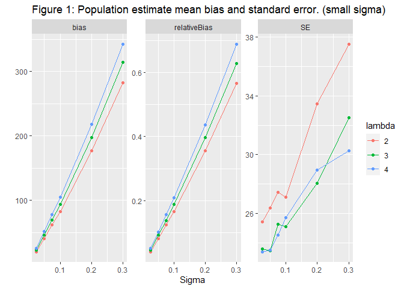
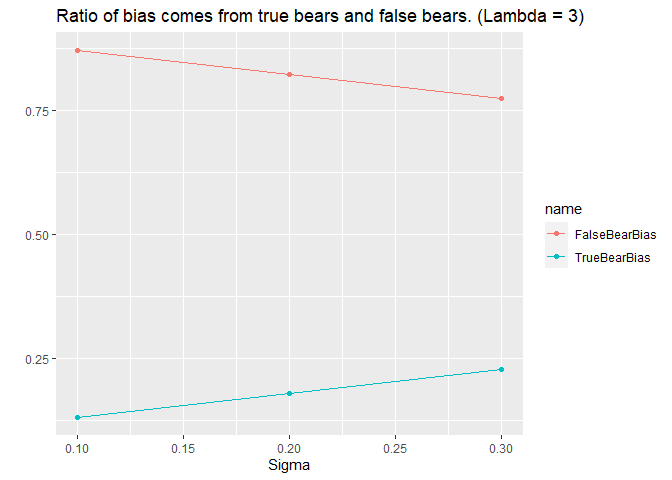

Bears Across Borders
================
Martin Andersson
2022-01-29

Graphs for the Naive Simulation.

<!-- --><!-- --><!-- -->

<!-- --><!-- --><!-- --><!-- --><!-- --><!-- -->

<!-- -->

<!-- --><!-- --><!-- -->

``` r
#map %>% ggplot() + geom_sf(aes(fill = Inventering)) + theme_void() +
#  geom_point(data = captures %>% filter(id == "BI041000 ZF-108"), 
#             aes(x = lon, y = lat, size=I(2),stroke=I(0),shape=I(16))) +
#  labs(title = "Territory Size")
```

***Introduction***

For several years now the population size and trends of brown bears in
four regions of Sweden have been monitored. The total population and how
it changes over time is important for conservation efforts and the
setting of hunting quotas. The monitoring and estimation of the bear
population is done through the collection of scat samples. The
collection is done by volunteers and genotypes are identified through
dna analysis and used to get an estimate of the number of bears from
which a scat sample has been obtained.

The estimation of the total bear population was modeled using the
Capture-Mark-Recapture method. A full explanation of the methods used
can be found in Kindberg2011

The collection of spill samples takes place over 5 years in which spill
samples are collected in one region each year in order with the fifth
year is an offyear when no collection takes place. The samples are
collected over 11 weeks in which the volunteers notes down the location
of the spill and collects a small piece to send in for dna analysis.

Region 1 consists of both Gävleborg and Dalarna,Region 2 is
Västerbottenslän, Region 3 consists of both Västernorrlandslän and
Jämtland , and Region 4 is Norrbottenslän

A problem with the division of Sweden into Regions in this way is that
brown bears do not care for these arbitrary borders. A bear could be
found on one side of the border one year and the other in another year.
Should this happen the bear would be counted twice for the census which
introduces bias to the estimation. The intention of this thesis is to
study the bias introduced by this border problem and analyzing whether
it is possible to make adjustments to account for this bias.

We assume that each bear has a territory of some shape with a
centerpoint. The centerpoints location determines which region a bear
belongs to. The shape of a bears territory is going to depend on a lot
of factors such as the geopraphy in the area and the age and condition
of the animal in question. Furthermore male and female bears behave
differently with some young male bears not sticking to any one area and
just wandering in whichever direction strikes their fancy. Trying to
estimate a territory unique for each bear using only samples of their
spill is very difficult further complicated by a large number of bears
for which only a single sample has been discovered and an unknown number
of bears for which no spill samples were found at all. As such we have
chosen to assume that each female bear has the same shaped territory and
likewise for the male bears. The chosen shape is

Introduction

*Why are we doing this?*

-Bear Inventory has been performed for several years. -Hunting quotas
are set at a regional level. -Studying bias from double counting bears.
-Estimating number of bears in each of the four regions.

*What have been done (literature review)?*
</li>

-   

-kindberg2011estimating

*How will we approach the problem?*

-Simple model that can be applied to all samples. -Number of spills
poisson distributed. -Bear territory a circle of specified size.

***First Draft***

For several years now the Swedish museum of natural history has been
performing an inventory of the brown bear population in the northern
half of Sweden. The region has been divided into four parts and every
year a different part is investigated and every fifth year no
investigations are performed. The investigation is done by soliciting
hunters among others to collect stool samples from bear that they find
in the forest and send it in for DNA analysis along with information on
where the sample was found.Conventional statistical methods have been
performed on the supplied data and estimated have been made over the
years but now more specific type of analysis has been requested.

(***WRITE SOMETHING ABOUT THE KINDBERG ARTICLE***)

Brown Bears have very large areas that they wander through and pay no
heed to the borders specified by humans. As such a bear might be found
in two different areas in two different years which can cause a bear to
be counted in both areas. This is a problem since hunting quotas are not
set at a national level but a regional level and as such knowing the
exact number of bears in each area is important. As such the purpouse of
my project is to estimate the bias introduced by double counting bears
and also create my own estimate of the total numbers of bears in each
area.

As a large number of bears have only been observed a single time and a
large number of bears have not been observed at all, trying to apply a
standard model for estimating the size and shape of a bears area is
going to be difficult if not impossible. As such for the sample at hand
i will be applying a simplified model that can be applied to all bears
independant of the number of samples we have from each. I will also be
performing a simulation study in which i will be using a more realistic
model for the size and shape of the bears territories. I will be making
the assumption that the number of samples from each bear follows a
poisson distribution and combined with the model on the bears areas i
will estimate the number of bears in each region.

(***Standardize choice of words***)

-Bears Territory/Bears Area

-Area/Region

***Method***

*What tools are we going to use:*

-Rstudio

*Statistical models and assumptions.*

-Poisson Model for number of samples found from each bear which can also
be used to estimate total number of bears.

-Simple model for size of territory (circle of constant size) along with
more complicated one for simulation studies (Bivariate normal) *How are
we going to estimate parameters?*

-Maximum likelihood. *Do we need numerical methods?*

-Numerical Methods for calculating the ratio of a bears territory lies
on which side of the border.

*Results*

-   

*Discussion*

-   

*References*

-bibtex file

    ## 
    ## To cite R in publications use:
    ## 
    ##   R Core Team (2021). R: A language and environment for statistical
    ##   computing. R Foundation for Statistical Computing, Vienna, Austria.
    ##   URL https://www.R-project.org/.
    ## 
    ## A BibTeX entry for LaTeX users is
    ## 
    ##   @Manual{,
    ##     title = {R: A Language and Environment for Statistical Computing},
    ##     author = {{R Core Team}},
    ##     organization = {R Foundation for Statistical Computing},
    ##     address = {Vienna, Austria},
    ##     year = {2021},
    ##     url = {https://www.R-project.org/},
    ##   }
    ## 
    ## We have invested a lot of time and effort in creating R, please cite it
    ## when using it for data analysis. See also 'citation("pkgname")' for
    ## citing R packages.
