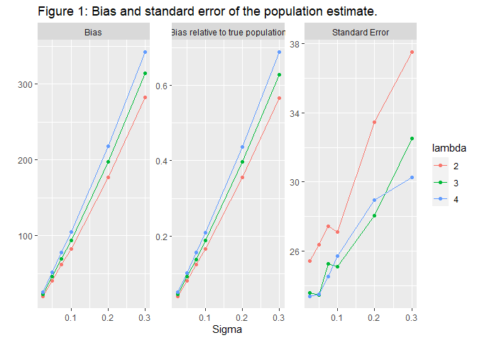
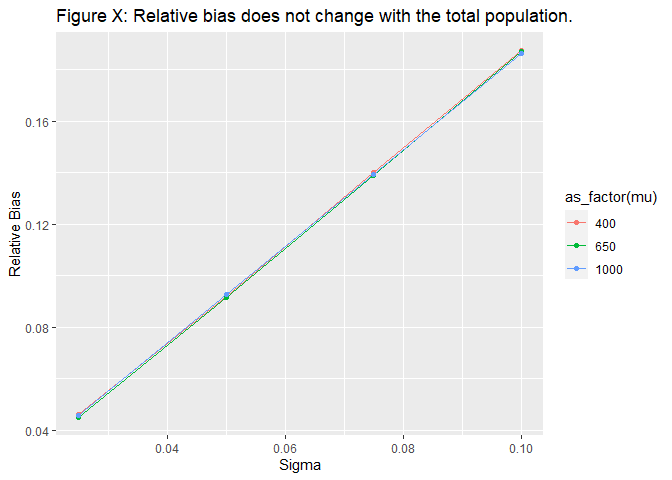

Bears Across Borders
================
Martin Andersson
2022-01-29

<!-- --><!-- -->

2 bears have a very large distance from their middlepoint.

| id                            | DistanceFromMean |
|:------------------------------|-----------------:|
| BI040801 XW274 ZF-310 X12-044 |        220681.05 |
| BI406977 Z15-247 +            |        184026.00 |
| BI041000 ZF-108               |        121381.45 |
| BI041294 ZF-87                |        114679.28 |
| BI406835 Z15-105              |        110256.56 |
| BI406835 Z15-105              |        110256.56 |
| BI416133 Z20-482              |         99257.74 |
| BI409367 X17-254              |         93254.73 |
| BI407004 Z15-274 +            |         91486.06 |
| BI415846 Z20-195              |         85676.67 |
| BI080097 W12-118              |         83689.80 |
| BI409101 W17-153              |         81688.12 |
| BI414883 AC19-112             |         75305.71 |
| BI414883 AC19-112             |         75305.71 |
| BI416282 Z20-631              |         68293.01 |
| BI407009 Z15-279 +            |         63629.75 |
| BI407009 Z15-279 +            |         63389.66 |
| BI407001 Z15-271              |         62408.08 |
| BI407009 Z15-279 +            |         57623.13 |
| BI407352 Z15-622 +            |         57584.13 |
| BI407216 Z15-486 +            |         53521.64 |
| BI407009 Z15-279 +            |         53184.63 |
| BI407731 BD16-209             |         52867.40 |
| BI407009 Z15-279 +            |         52501.24 |
| BI407216 Z15-486 +            |         51618.65 |
| BI041000 ZF-108               |         51176.86 |
| BI407009 Z15-279 +            |         50826.26 |
| BI409038 W17-090              |         50810.32 |
| BI040801 XW274 ZF-310 X12-044 |         50750.33 |
| BI407009 Z15-279 +            |         49952.44 |

I graphed the 2 outliers spill locations.

<!-- --><!-- -->

Might be a problem. Possible fixes: Ignoring the 2 outliers and choosing
the third largest distance as the estimate of a bears territory.
Switching midpoints from the average value of the spills to a point
whose lateral coordinate is the average value of the Westernmost samples
lateral coordinate and the Easternmost samples lateral coordinate and
likewise for longitude coordinate. This would center the midpoint so
that the longest distance from midpoint to furthest sample is less
extreme.

Introduction

*Why are we doing this?*

-Bear Inventory has been performed for several years. -Hunting quotas
are set at a regional level. -Studying bias from double counting bears.
-Estimating number of bears in each of the four regions.

*What have been done (literature review)?*
</li>

-   

-kindberg2011estimating

*How will we approach the problem?*

-Simple model that can be applied to all samples. -Number of spills
poisson distributed. -Bear territory a circle of specified size.

***First Draft***

For several years now the Swedish museum of natural history has been
performing an inventory of the brown bear population in the northern
half of Sweden. The region has been divided into four parts and every
year a different part is investigated and every fifth year no
investigations are performed. The investigation is done by soliciting
hunters among others to collect stool samples from bear that they find
in the forest and send it in for DNA analysis along with information on
where the sample was found.Conventional statistical methods have been
performed on the supplied data and estimated have been made over the
years but now more specific type of analysis has been requested.

(***WRITE SOMETHING ABOUT THE KINDBERG ARTICLE***)

Brown Bears have very large areas that they wander through and pay no
heed to the borders specified by humans. As such a bear might be found
in two different areas in two different years which can cause a bear to
be counted in both areas. This is a problem since hunting quotas are not
set at a national level but a regional level and as such knowing the
exact number of bears in each area is important. As such the purpouse of
my project is to estimate the bias introduced by double counting bears
and also create my own estimate of the total numbers of bears in each
area.

As a large number of bears have only been observed a single time and a
large number of bears have not been observed at all, trying to apply a
standard model for estimating the size and shape of a bears area is
going to be difficult if not impossible. As such for the sample at hand
i will be applying a simplified model that can be applied to all bears
independant of the number of samples we have from each. I will also be
performing a simulation study in which i will be using a more realistic
model for the size and shape of the bears territories. I will be making
the assumption that the number of samples from each bear follows a
poisson distribution and combined with the model on the bears areas i
will estimate the number of bears in each region.

(***Standardize choice of words***)

-Bears Territory/Bears Area

-Area/Region

***Method***

*What tools are we going to use:*

-Rstudio

*Statistical models and assumptions.*

-Poisson Model for number of samples found from each bear which can also
be used to estimate total number of bears.

-Simple model for size of territory (circle of constant size) along with
more complicated one for simulation studies (Bivariate normal) *How are
we going to estimate parameters?*

-Maximum likelihood. *Do we need numerical methods?*

-Numerical Methods for calculating the ratio of a bears territory lies
on which side of the border.

*Results*

-   

*Discussion*

-Try to collect samples from outside Sweden as well.

*References*

-bibtex file

    ## 
    ## To cite R in publications use:
    ## 
    ##   R Core Team (2021). R: A language and environment for statistical
    ##   computing. R Foundation for Statistical Computing, Vienna, Austria.
    ##   URL https://www.R-project.org/.
    ## 
    ## A BibTeX entry for LaTeX users is
    ## 
    ##   @Manual{,
    ##     title = {R: A Language and Environment for Statistical Computing},
    ##     author = {{R Core Team}},
    ##     organization = {R Foundation for Statistical Computing},
    ##     address = {Vienna, Austria},
    ##     year = {2021},
    ##     url = {https://www.R-project.org/},
    ##   }
    ## 
    ## We have invested a lot of time and effort in creating R, please cite it
    ## when using it for data analysis. See also 'citation("pkgname")' for
    ## citing R packages.
